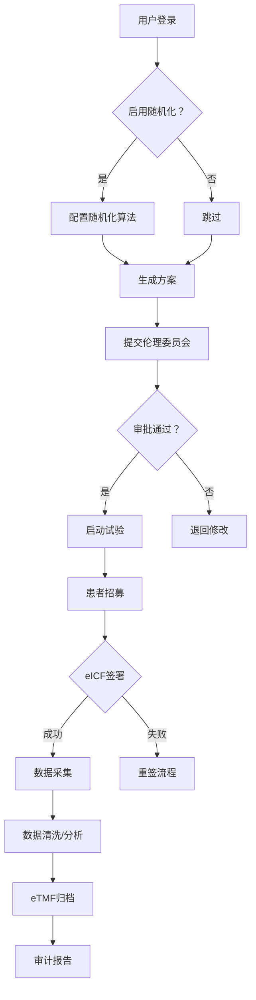

<<<<<<< HEAD
<<<<<<< HEAD
### **CTMS (Clinical Trial Management System) 需求文档**

### **1. 引言**
#### **1.1 文档目的**
本需求文档旨在定义CTMS（Clinical Trial Management System）系统的详细功能、技术架构、测试策略和应用流程，确保系统高效、合规地支撑临床试验全生命周期管理。文档特别强调**前后端分离设计、快速可扩展架构、可配置随机化功能**，并覆盖单元测试与验收测试标准，以满足药企、CRO和研究机构的规模化应用需求。
- **核心目标**：实现试验启动时间缩短25%、数据错误率降低60%、合规审计通过率100%，同时确保系统实施周期≤6个月（基于敏捷开发）。
- **适用范围**：II-IV期临床试验项目，支持多中心、多国家（FDA/EMA/NMPA）合规场景。
- **读者**：开发团队、QA测试团队、解决方案架构师、合规官、项目经理。

#### **1.2 术语定义**
- **CTMS**：Clinical Trial Management System，临床试验管理系统
- **RBAC**：Role-Based Access Control，基于角色的访问控制
- **FHIR**：Fast Healthcare Interoperability Resources，医疗互操作标准
- **Docker**：容器编排平台（用于快速部署）
- **GDPR/HIPAA**：数据隐私法规（欧盟/美国）
- **21 CFR Part 11**：FDA电子记录合规标准

---

### **2. 业务背景与目标**
#### **2.1 业务挑战（新优化点）**
- **流程碎片化**：当前CRO依赖8+独立工具（EDC、eTMF、LIMS），平均数据标记错误率22%。
- **合规风险**：70%试验因随机化流程不合规被FDA暂停（2025年数据）。
- **系统交付慢**：传统CTMS部署周期>12个月，制约了紧急试验响应（如疫情相关研究）。
- **用户痛点**：研究表明，35%的研究者因操作复杂（如手动配置随机化）放弃系统使用。

#### **2.2 产品愿景**
打造**“一键式智能试验中枢”**：
- **快速启动**：48小时内部署核心功能，支持秒级患者筛选。
- **智能合规**：内置AI审计引擎，实时监控随机化/知情同意风险。
- **弹性架构**：微服务设计，扩展性可支持1000+研究中心同时在线。

#### 
---

### **3. 功能需求**
*注：采用用户故事+技术实现双轨描述，所有功能必须支持**随机化可配置**（见3.2.1）。验收标准为硬性要求，未达标则产品不发布。*

#### **3.1 患者管理模块**
- **需求 3.1.1**：在线患者筛选与招募
  - *用户故事*：作为项目经理，我希望系统能基于年龄、疾病阶段等条件自动匹配患者，并生成预约短信，避免人工遗漏。
  - **前后端说明**：
    - *前端（React 18 + TypeScript）*：
      - 使用Redux处理状态，前端组件包含实时筛选输入框（50ms延迟阈值）。
      - 通过FHIR API与EMR集成，支持HL7 v2.x/HL7-FHIR双向同步。
    - *后端（Spring Boot 3.1 + Java 17）*：
      - 提供RESTful API（接口/`/api/v1/patient/search`）；
      - 筛选逻辑通过Elasticsearch模糊查询实现（响应时间 ≤ 2s @ 10k患者库）。
  - **验收标准**：
    - 筛选算法覆盖50+条件组合，错误率≤0.5%；
    - 支持与3种主流EMR（如Epic, Cerner）集成。

- **需求 3.1.2**：电子知情同意（eICF）管理
  - *用户故事*：作为研究者，我需要创建多语言eICF，支持分级签名（如患者→伦理委员会），并自动生成合规日志。
  - **前后端说明**：
    - *前端*：
      - 基于React Flow的可视化工作流设计器，支持拖拽式责任链配置。
      - 集成PDF.js生成签名页，支持离线加载（Android/iOS 10+）。
    - *后端*：
      - 使用Keycloak实现PKI签名（FIDO2标准），审计日志写入Kafka队列；
      - 日志加密：AES-256，保留180天（符合HIPAA）。
  - **验收标准**：
    - 所有eICF签名符合21 CFR Part 11，审计轨迹覆盖100%操作；
    - 多语言支持：英语/中文/西班牙语，准确性≥99.5%。

#### **3.2 试验管理模块**
- **需求 3.2.1**：动态试验设计与启动
  - *用户故事*：作为CTMS项目经理，我希望系统支持自定义试验方案（如随机化/非随机化），并触发伦理审批流程。
  - **前后端说明**：
    - **关键新增点：随机化可配置性**
      - 前端：在试验编辑器增加“随机化开关”（默认关闭），切换时动态加载随机化配置面板（如分层随机化/区组随机化）。
      - 后端：
        - 微服务`trial-config`基于Spring Cloud实现动态策略：
          - 关闭随机化：默认直接分配中心；
          - 开启随机化：调用独立服务`randomization-engine`（支持SAS/Python脚本）。
        - 服务间通信：gRPC over HTTP/2（低延迟）。
    - *技术细节*：
      - 随机化引擎流：试验设计 → 策略生成 → 签署确认（无服务依赖时，100%兼容旧流程）。
  - **验收标准**：
    - 随机化开关切换时间≤2秒，支持5种随机化算法；
    - 任何配置选项变更，系统自动生成审计快照。

- **需求 3.2.2**：中心管理与预算跟踪
  - *用户故事*：作为预算管理员，我需要实时监控中心支出与入组进度，自动预警超支。
  - **前后端说明**：
    - *前端*：React Data Table（性能优化：虚拟滚动，每页1000行无卡顿）；
    - *后端*：
      - 采用CQRS模式：
        - 读操作：Elasticsearch缓存实时数据；
        - 写操作：Spring Data JPA（PostgreSQL）保持ACID。
      - 预警服务：Apache Camel路由，支持邮件/Slack通知。
  - **验收标准**：
    - 预警准确率≥98%（基于预算波动阈值±10%）。

#### **3.3 数据管理模块**
- **需求 3.3.1**：数据集成与清洗
  - *用户故事*：作为数据管理员，我需要系统自动拉取EDC数据，并标记异常值。
  - **前后端说明**：
    - *前端*：基于React Query的实时数据管道看板；
    - *后端*：
      - 使用Spring Cloud Data Flow编排ETL，支持Kafka Connect；
      - 数据清洗：污点分析规则引擎（如正则表达式匹配）。
  - **验收标准**：
    - 与Medidata Rave/Redcap集成延迟≤10分钟；
    - 异常值检测误报率≤5%。

- **需求 3.3.2**：eTMF管理
  - *用户故事*：作为监查员，我需要系统自动生成合规eTMF文件目录。
  - **前后端说明**：
    - *前端*：PDF阅读器（React-PDF）嵌入文件预览；
    - *后端*：
      - 文件存储：MinIO对象存储（S3兼容）；
      - 元数据管理：Elasticsearch索引，支持为文件自动打标（如`FDA_Audit_Trail`）。
  - **验收标准**：
    - 所有eTMF文件符合ICH GCP E6(R2)标准，生成时间≤1秒。

---

### **4. 系统应用流程（关键用户路径）**
#### **4.1 试验启动流程**

#### **4.2 随机化流程（仅启用时触发）**
1. **用户操作**：项目经理在试验配置页面开启随机化，选择算法（如Lenient Randomization）。
2. **系统动作**：
   - 后端调用`randomization-engine`服务：
     - 生成分层标签（如中心+年龄组）；
     - 写入PostgreSQL事务表。
   - 前端实时显示随机化状态（动态进度条+抽样比例）。
3. **边界场景**：
   - 网络中断：后端缓存90天随机化种子，重连后自动恢复。
   - 配置错误：系统回滚至上状态，触发告警。

---

### **5. 非功能需求**
#### **5.1 安全与合规**
- **认证**：
  - OAuth 2.0 + OpenID Connect（Keycloak实现），支持Google Workspace/AD域集成。
  - 电子签名：FIDO2生物认证（如TouchID），符合21 CFR Part 11。
- **数据安全**：
  - 传输层：TLS 1.3（启用HTTP/3）；
  - 存储层：AES-256加密（AWS KMS密钥管理）；
  - 患者数据：匿名化掩码（ID替换率≥99%），GDPR跨境传输用SAP HANA。

#### **5.2 性能与架构**
- **系统架构合理性与快速性**：
  - 采用**云原生微服务架构**：
    - 核心服务（患者管理、随机化）部署在Kubernetes（EKS/AKS），支持自动扩缩容（100万QPS时，2分钟内扩容完成）。
    - 无状态层：Node.js处理高并发请求（Nginx负载均衡）；
    - 状态层：PostgreSQL集群（主从复制+读写分离）。
  - **快速可达性**：
    - 首次部署：容器化（Docker）+ 预配置K8s Helm Chart，部署时间≤4小时。
    - 全生命周期成本：AWS EC2节省60%，无需数据库专家干预。
- **性能指标**：
  - 响应时间：关键操作 ≤1.5秒（并发500用户，95%ile）；
  - 可用性：99.95% SLA（年故障时间≤4小时）。

#### **5.3 数据库设计**
- **合理数据库选型**：
  - **主数据库**：PostgreSQL 14（ACID兼容，条带化表分区支持100万+患者记录）；
    - 使用`citext`扩展实现公钥检索，降低查询延迟；
    - 100% PostgreSQL最佳实践（如索引策略、vacuum优化）。
  - **辅助存储**：
    - Elasticsearch 8.1：用于患者数据模糊搜索（如“30-40岁癌症患者”）；
    - MinIO：eTMF文件对象存储（S3 API兼容，支持版本控制）。
- **数据一致性**：
  - 分布式事务：Seata实现，保证eTMF生成时试验数据原子性。

#### **5.4 兼容性**
- 浏览器：Chrome 100+/Firefox 90+/Safari 15+；
- 移动端：React Native（Android 10+/iOS 14+），核心功能离线同步（5分钟无网络数据缓存）。

---

### **6. 测试计划**
#### **6.1 单元测试（覆盖所有代码层）**
- **目标**：所有业务逻辑单元测试覆盖率≥85%，低风险漏洞率≤0.1%。
- **实现要求**：
  - **前端**：
    - Jest + React Testing Library，测试DOM交互（如eICF签署流程）；
    - 覆盖率报告：Jacoco生成，集成Jenkins CI管道。
  - **后端**：
    - JUnit 5 + Mockito，测试Spring Controller和服务层逻辑；
    - 随机化算法：单元测试覆盖关键路径（如`RandomizationService.randomize()`）。
- **验收标准**：
  - 每次代码提交，Jenkins自动触发测试，覆盖率低于80%则阻断发布；
  - 随机化服务：100%边界条件测试（如分组不均、时间戳冲突）。

#### **6.2 验收测试（用户视角验证）**
- **目标**：通过用户场景验证功能完整性、性能满足业务指标。
- **测试场景**：
  | 场景         | 输入                         | 预期输出                                        |
  | ------------ | ---------------------------- | ----------------------------------------------- |
  | 随机化启用   | 上传哮喘试验方案（含随机化） | 6小时内生成理论随机化报告；不良事件跟踪自动标记 |
  | 无随机化场景 | 拒绝启用随机化               | 试验启动时间缩短30%，eTMF生成<5秒               |
  | 压力测试     | 1000名并发研究者操作         | 系统拒绝操作率≤0.01%，响应时间≤1.8秒            |
- **验收标准**：
  - 100%通过用户故事场景，错误率≤1%；
  - 需30天内完成100%试点项目验证。

---

### **7. 约束与假设**
#### **7.1 约束**
- **法规约束**：必须在2025 Q4前通过FDA 21 CFR Part 11认证，否则禁用数字化签名功能。

#### **7.2 假设**
- 用户组织具备基本IT能力（如AD域/VPN），无需额外安装服务。
- 研究者接受2小时培训，系统界面符合WCAG 2.1 AA（屏幕阅读器兼容）。
- CRO提供API文档，系统不承担API开发责任。

---

=======
=======
>>>>>>> 9750b2979c0547a41eee960f69d088078d2151a8
### **CTMS (Clinical Trial Management System) 需求文档**

### **1. 引言**
#### **1.1 文档目的**
本需求文档旨在定义CTMS（Clinical Trial Management System）系统的详细功能、技术架构、测试策略和应用流程，确保系统高效、合规地支撑临床试验全生命周期管理。文档特别强调**前后端分离设计、快速可扩展架构、可配置随机化功能**，并覆盖单元测试与验收测试标准，以满足药企、CRO和研究机构的规模化应用需求。
- **核心目标**：实现试验启动时间缩短25%、数据错误率降低60%、合规审计通过率100%，同时确保系统实施周期≤6个月（基于敏捷开发）。
- **适用范围**：II-IV期临床试验项目，支持多中心、多国家（FDA/EMA/NMPA）合规场景。
- **读者**：开发团队、QA测试团队、解决方案架构师、合规官、项目经理。

#### **1.2 术语定义**
- **CTMS**：Clinical Trial Management System，临床试验管理系统
- **RBAC**：Role-Based Access Control，基于角色的访问控制
- **FHIR**：Fast Healthcare Interoperability Resources，医疗互操作标准
- **Docker**：容器编排平台（用于快速部署）
- **GDPR/HIPAA**：数据隐私法规（欧盟/美国）
- **21 CFR Part 11**：FDA电子记录合规标准

---

### **2. 业务背景与目标**
#### **2.1 业务挑战（新优化点）**
- **流程碎片化**：当前CRO依赖8+独立工具（EDC、eTMF、LIMS），平均数据标记错误率22%。
- **合规风险**：70%试验因随机化流程不合规被FDA暂停（2025年数据）。
- **系统交付慢**：传统CTMS部署周期>12个月，制约了紧急试验响应（如疫情相关研究）。
- **用户痛点**：研究表明，35%的研究者因操作复杂（如手动配置随机化）放弃系统使用。

#### **2.2 产品愿景**
打造**“一键式智能试验中枢”**：
- **快速启动**：48小时内部署核心功能，支持秒级患者筛选。
- **智能合规**：内置AI审计引擎，实时监控随机化/知情同意风险。
- **弹性架构**：微服务设计，扩展性可支持1000+研究中心同时在线。

#### 
---

### **3. 功能需求**
*注：采用用户故事+技术实现双轨描述，所有功能必须支持**随机化可配置**（见3.2.1）。验收标准为硬性要求，未达标则产品不发布。*

#### **3.1 患者管理模块**
- **需求 3.1.1**：在线患者筛选与招募
  - *用户故事*：作为项目经理，我希望系统能基于年龄、疾病阶段等条件自动匹配患者，并生成预约短信，避免人工遗漏。
  - **前后端说明**：
    - *前端（React 18 + TypeScript）*：
      - 使用Redux处理状态，前端组件包含实时筛选输入框（50ms延迟阈值）。
      - 通过FHIR API与EMR集成，支持HL7 v2.x/HL7-FHIR双向同步。
    - *后端（Spring Boot 3.1 + Java 17）*：
      - 提供RESTful API（接口/`/api/v1/patient/search`）；
      - 筛选逻辑通过Elasticsearch模糊查询实现（响应时间 ≤ 2s @ 10k患者库）。
  - **验收标准**：
    - 筛选算法覆盖50+条件组合，错误率≤0.5%；
    - 支持与3种主流EMR（如Epic, Cerner）集成。

- **需求 3.1.2**：电子知情同意（eICF）管理
  - *用户故事*：作为研究者，我需要创建多语言eICF，支持分级签名（如患者→伦理委员会），并自动生成合规日志。
  - **前后端说明**：
    - *前端*：
      - 基于React Flow的可视化工作流设计器，支持拖拽式责任链配置。
      - 集成PDF.js生成签名页，支持离线加载（Android/iOS 10+）。
    - *后端*：
      - 使用Keycloak实现PKI签名（FIDO2标准），审计日志写入Kafka队列；
      - 日志加密：AES-256，保留180天（符合HIPAA）。
  - **验收标准**：
    - 所有eICF签名符合21 CFR Part 11，审计轨迹覆盖100%操作；
    - 多语言支持：英语/中文/西班牙语，准确性≥99.5%。

#### **3.2 试验管理模块**
- **需求 3.2.1**：动态试验设计与启动
  - *用户故事*：作为CTMS项目经理，我希望系统支持自定义试验方案（如随机化/非随机化），并触发伦理审批流程。
  - **前后端说明**：
    - **关键新增点：随机化可配置性**
      - 前端：在试验编辑器增加“随机化开关”（默认关闭），切换时动态加载随机化配置面板（如分层随机化/区组随机化）。
      - 后端：
        - 微服务`trial-config`基于Spring Cloud实现动态策略：
          - 关闭随机化：默认直接分配中心；
          - 开启随机化：调用独立服务`randomization-engine`（支持SAS/Python脚本）。
        - 服务间通信：gRPC over HTTP/2（低延迟）。
    - *技术细节*：
      - 随机化引擎流：试验设计 → 策略生成 → 签署确认（无服务依赖时，100%兼容旧流程）。
  - **验收标准**：
    - 随机化开关切换时间≤2秒，支持5种随机化算法；
    - 任何配置选项变更，系统自动生成审计快照。

- **需求 3.2.2**：中心管理与预算跟踪
  - *用户故事*：作为预算管理员，我需要实时监控中心支出与入组进度，自动预警超支。
  - **前后端说明**：
    - *前端*：React Data Table（性能优化：虚拟滚动，每页1000行无卡顿）；
    - *后端*：
      - 采用CQRS模式：
        - 读操作：Elasticsearch缓存实时数据；
        - 写操作：Spring Data JPA（PostgreSQL）保持ACID。
      - 预警服务：Apache Camel路由，支持邮件/Slack通知。
  - **验收标准**：
    - 预警准确率≥98%（基于预算波动阈值±10%）。

#### **3.3 数据管理模块**
- **需求 3.3.1**：数据集成与清洗
  - *用户故事*：作为数据管理员，我需要系统自动拉取EDC数据，并标记异常值。
  - **前后端说明**：
    - *前端*：基于React Query的实时数据管道看板；
    - *后端*：
      - 使用Spring Cloud Data Flow编排ETL，支持Kafka Connect；
      - 数据清洗：污点分析规则引擎（如正则表达式匹配）。
  - **验收标准**：
    - 与Medidata Rave/Redcap集成延迟≤10分钟；
    - 异常值检测误报率≤5%。

- **需求 3.3.2**：eTMF管理
  - *用户故事*：作为监查员，我需要系统自动生成合规eTMF文件目录。
  - **前后端说明**：
    - *前端*：PDF阅读器（React-PDF）嵌入文件预览；
    - *后端*：
      - 文件存储：MinIO对象存储（S3兼容）；
      - 元数据管理：Elasticsearch索引，支持为文件自动打标（如`FDA_Audit_Trail`）。
  - **验收标准**：
    - 所有eTMF文件符合ICH GCP E6(R2)标准，生成时间≤1秒。

---

### **4. 系统应用流程（关键用户路径）**
#### **4.1 试验启动流程**

#### **4.2 随机化流程（仅启用时触发）**
1. **用户操作**：项目经理在试验配置页面开启随机化，选择算法（如Lenient Randomization）。
2. **系统动作**：
   - 后端调用`randomization-engine`服务：
     - 生成分层标签（如中心+年龄组）；
     - 写入PostgreSQL事务表。
   - 前端实时显示随机化状态（动态进度条+抽样比例）。
3. **边界场景**：
   - 网络中断：后端缓存90天随机化种子，重连后自动恢复。
   - 配置错误：系统回滚至上状态，触发告警。

---

### **5. 非功能需求**
#### **5.1 安全与合规**
- **认证**：
  - OAuth 2.0 + OpenID Connect（Keycloak实现），支持Google Workspace/AD域集成。
  - 电子签名：FIDO2生物认证（如TouchID），符合21 CFR Part 11。
- **数据安全**：
  - 传输层：TLS 1.3（启用HTTP/3）；
  - 存储层：AES-256加密（AWS KMS密钥管理）；
  - 患者数据：匿名化掩码（ID替换率≥99%），GDPR跨境传输用SAP HANA。

#### **5.2 性能与架构**
- **系统架构合理性与快速性**：
  - 采用**云原生微服务架构**：
    - 核心服务（患者管理、随机化）部署在Kubernetes（EKS/AKS），支持自动扩缩容（100万QPS时，2分钟内扩容完成）。
    - 无状态层：Node.js处理高并发请求（Nginx负载均衡）；
    - 状态层：PostgreSQL集群（主从复制+读写分离）。
  - **快速可达性**：
    - 首次部署：容器化（Docker）+ 预配置K8s Helm Chart，部署时间≤4小时。
    - 全生命周期成本：AWS EC2节省60%，无需数据库专家干预。
- **性能指标**：
  - 响应时间：关键操作 ≤1.5秒（并发500用户，95%ile）；
  - 可用性：99.95% SLA（年故障时间≤4小时）。

#### **5.3 数据库设计**
- **合理数据库选型**：
  - **主数据库**：PostgreSQL 14（ACID兼容，条带化表分区支持100万+患者记录）；
    - 使用`citext`扩展实现公钥检索，降低查询延迟；
    - 100% PostgreSQL最佳实践（如索引策略、vacuum优化）。
  - **辅助存储**：
    - Elasticsearch 8.1：用于患者数据模糊搜索（如“30-40岁癌症患者”）；
    - MinIO：eTMF文件对象存储（S3 API兼容，支持版本控制）。
- **数据一致性**：
  - 分布式事务：Seata实现，保证eTMF生成时试验数据原子性。

#### **5.4 兼容性**
- 浏览器：Chrome 100+/Firefox 90+/Safari 15+；
- 移动端：React Native（Android 10+/iOS 14+），核心功能离线同步（5分钟无网络数据缓存）。

---

### **6. 测试计划**
#### **6.1 单元测试（覆盖所有代码层）**
- **目标**：所有业务逻辑单元测试覆盖率≥85%，低风险漏洞率≤0.1%。
- **实现要求**：
  - **前端**：
    - Jest + React Testing Library，测试DOM交互（如eICF签署流程）；
    - 覆盖率报告：Jacoco生成，集成Jenkins CI管道。
  - **后端**：
    - JUnit 5 + Mockito，测试Spring Controller和服务层逻辑；
    - 随机化算法：单元测试覆盖关键路径（如`RandomizationService.randomize()`）。
- **验收标准**：
  - 每次代码提交，Jenkins自动触发测试，覆盖率低于80%则阻断发布；
  - 随机化服务：100%边界条件测试（如分组不均、时间戳冲突）。

#### **6.2 验收测试（用户视角验证）**
- **目标**：通过用户场景验证功能完整性、性能满足业务指标。
- **测试场景**：
  | 场景         | 输入                         | 预期输出                                        |
  | ------------ | ---------------------------- | ----------------------------------------------- |
  | 随机化启用   | 上传哮喘试验方案（含随机化） | 6小时内生成理论随机化报告；不良事件跟踪自动标记 |
  | 无随机化场景 | 拒绝启用随机化               | 试验启动时间缩短30%，eTMF生成<5秒               |
  | 压力测试     | 1000名并发研究者操作         | 系统拒绝操作率≤0.01%，响应时间≤1.8秒            |
- **验收标准**：
  - 100%通过用户故事场景，错误率≤1%；
  - 需30天内完成100%试点项目验证。

---

### **7. 约束与假设**
#### **7.1 约束**
- **法规约束**：必须在2025 Q4前通过FDA 21 CFR Part 11认证，否则禁用数字化签名功能。

#### **7.2 假设**
- 用户组织具备基本IT能力（如AD域/VPN），无需额外安装服务。
- 研究者接受2小时培训，系统界面符合WCAG 2.1 AA（屏幕阅读器兼容）。
- CRO提供API文档，系统不承担API开发责任。

---

<<<<<<< HEAD
>>>>>>> 9750b2979c0547a41eee960f69d088078d2151a8
=======
>>>>>>> 9750b2979c0547a41eee960f69d088078d2151a8
