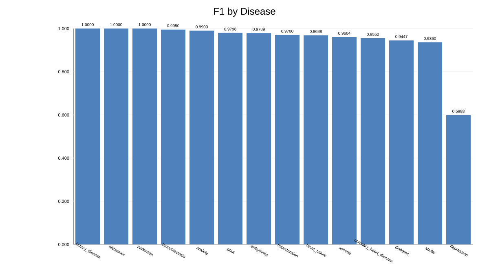

<<<<<<< HEAD
# 模型总览报告

- 生成时间: 2026-03-13 17:19:22
- 评估病种数: 14
- 使用样本数: 1000
- 漂移告警数: 6
- 重训练触发数: 0

## 总览图表

## 每病指标

| 疾病 | Accuracy | Precision | Recall | F1 | AUROC | 稳定性F1_STD | PSI | KS | 漂移告警 | 重训练触发 |
|---|---:|---:|---:|---:|---:|---:|---:|---:|---:|---:|
| kidney_disease | 1.0000 | 1.0000 | 1.0000 | 1.0000 | 1.0000 | 0.000000 | 0.2099 | 0.1100 | 1 | 0 |
| alzheimer | 1.0000 | 1.0000 | 1.0000 | 1.0000 | 1.0000 | 0.000000 | 0.0232 | 0.0500 | 0 | 0 |
| parkinson | 1.0000 | 1.0000 | 1.0000 | 1.0000 | 1.0000 | 0.000000 | 0.0466 | 0.0350 | 0 | 0 |
| bronchiectasis | 0.9950 | 1.0000 | 0.9901 | 0.9950 | 1.0000 | 0.000000 | 0.0046 | 0.0150 | 0 | 0 |
| anxiety | 0.9900 | 1.0000 | 0.9802 | 0.9900 | 0.9982 | 0.000000 | 0.0612 | 0.0650 | 0 | 0 |
| gout | 0.9800 | 0.9798 | 0.9798 | 0.9798 | 0.9963 | 0.000000 | 0.1399 | 0.0850 | 1 | 0 |
| arrhythmia | 0.9800 | 0.9789 | 0.9789 | 0.9789 | 0.9982 | 0.000000 | 0.1897 | 0.1100 | 1 | 0 |
| hypertension | 0.9700 | 0.9798 | 0.9604 | 0.9700 | 0.9980 | 0.000000 | 0.0772 | 0.0650 | 0 | 0 |
| heart_failure | 0.9700 | 0.9894 | 0.9490 | 0.9688 | 0.9963 | 0.000000 | 0.0654 | 0.0600 | 0 | 0 |
| asthma | 0.9600 | 0.9604 | 0.9604 | 0.9604 | 0.9933 | 0.000000 | 0.1450 | 0.0550 | 1 | 0 |
| coronary_heart_disease | 0.9550 | 0.9412 | 0.9697 | 0.9552 | 0.9915 | 0.000000 | 0.0598 | 0.0750 | 0 | 0 |
| diabetes | 0.9450 | 0.9400 | 0.9495 | 0.9447 | 0.9896 | 0.000000 | 0.1958 | 0.0800 | 1 | 0 |
| stroke | 0.9350 | 0.9314 | 0.9406 | 0.9360 | 0.9778 | 0.000000 | 0.1011 | 0.0900 | 1 | 0 |
| depression | 0.6650 | 0.6849 | 0.5319 | 0.5988 | 0.7544 | 0.000000 | 0.0614 | 0.1000 | 0 | 0 |

## 关键信息

- 最佳F1病种: kidney_disease
- 最低F1病种: depression
=======
# 模型总览报告

- 生成时间: 2026-03-13 17:19:22
- 评估病种数: 14
- 使用样本数: 1000
- 漂移告警数: 6
- 重训练触发数: 0

## 总览图表

## 每病指标

| 疾病 | Accuracy | Precision | Recall | F1 | AUROC | 稳定性F1_STD | PSI | KS | 漂移告警 | 重训练触发 |
|---|---:|---:|---:|---:|---:|---:|---:|---:|---:|---:|
| kidney_disease | 1.0000 | 1.0000 | 1.0000 | 1.0000 | 1.0000 | 0.000000 | 0.2099 | 0.1100 | 1 | 0 |
| alzheimer | 1.0000 | 1.0000 | 1.0000 | 1.0000 | 1.0000 | 0.000000 | 0.0232 | 0.0500 | 0 | 0 |
| parkinson | 1.0000 | 1.0000 | 1.0000 | 1.0000 | 1.0000 | 0.000000 | 0.0466 | 0.0350 | 0 | 0 |
| bronchiectasis | 0.9950 | 1.0000 | 0.9901 | 0.9950 | 1.0000 | 0.000000 | 0.0046 | 0.0150 | 0 | 0 |
| anxiety | 0.9900 | 1.0000 | 0.9802 | 0.9900 | 0.9982 | 0.000000 | 0.0612 | 0.0650 | 0 | 0 |
| gout | 0.9800 | 0.9798 | 0.9798 | 0.9798 | 0.9963 | 0.000000 | 0.1399 | 0.0850 | 1 | 0 |
| arrhythmia | 0.9800 | 0.9789 | 0.9789 | 0.9789 | 0.9982 | 0.000000 | 0.1897 | 0.1100 | 1 | 0 |
| hypertension | 0.9700 | 0.9798 | 0.9604 | 0.9700 | 0.9980 | 0.000000 | 0.0772 | 0.0650 | 0 | 0 |
| heart_failure | 0.9700 | 0.9894 | 0.9490 | 0.9688 | 0.9963 | 0.000000 | 0.0654 | 0.0600 | 0 | 0 |
| asthma | 0.9600 | 0.9604 | 0.9604 | 0.9604 | 0.9933 | 0.000000 | 0.1450 | 0.0550 | 1 | 0 |
| coronary_heart_disease | 0.9550 | 0.9412 | 0.9697 | 0.9552 | 0.9915 | 0.000000 | 0.0598 | 0.0750 | 0 | 0 |
| diabetes | 0.9450 | 0.9400 | 0.9495 | 0.9447 | 0.9896 | 0.000000 | 0.1958 | 0.0800 | 1 | 0 |
| stroke | 0.9350 | 0.9314 | 0.9406 | 0.9360 | 0.9778 | 0.000000 | 0.1011 | 0.0900 | 1 | 0 |
| depression | 0.6650 | 0.6849 | 0.5319 | 0.5988 | 0.7544 | 0.000000 | 0.0614 | 0.1000 | 0 | 0 |

## 关键信息

- 最佳F1病种: kidney_disease
- 最低F1病种: depression
>>>>>>> origin/main
- 汇总均值: accuracy=0.9532, precision=0.9561, recall=0.9422, f1=0.9484, auroc=0.9781