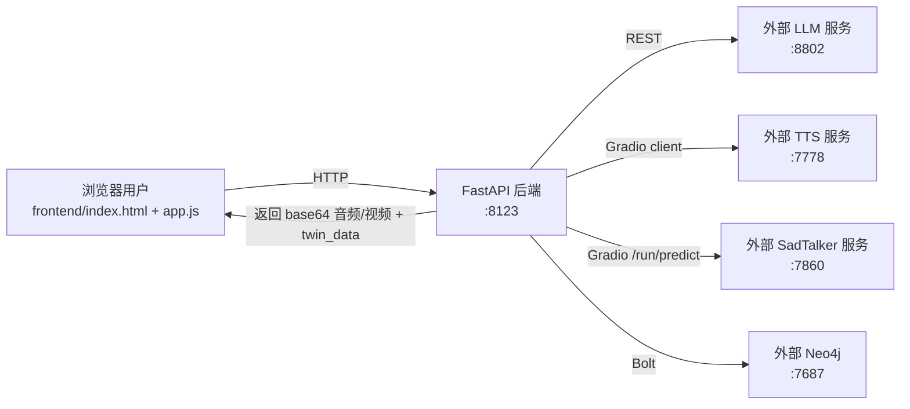

# 数字孪生医生系统：当前架构与功能说明（落地实现版）

本文档以仓库 `/home/user/Dr_Digital_Twin_Project` 的当前代码实现为准，对系统架构、模块边界、关键数据流与功能进行详细说明，并指出与规划文档的差异与可落地的演进方向。

## 1. 系统概览

系统目标：提供一个“虚拟医生”交互入口，将用户输入（文本/语音）转为医疗对话回复，并进一步生成语音与数字人视频，形成可播放的多媒体输出。

当前实现形态：
- 后端：FastAPI 单体服务，统一编排对话、TTS、数字人视频等流程，入口见 [main.py](file:///home/user/Dr_Digital_Twin_Project/backend/main.py#L117-L342)
- 前端：静态网页（Bootstrap/jQuery），负责录音/文本输入、调用后端 API、播放音视频与展示推理路径，入口见 [index.html](file:///home/user/Dr_Digital_Twin_Project/frontend/index.html#L1-L103) 与 [app.js](file:///home/user/Dr_Digital_Twin_Project/frontend/js/app.js#L1-L254)
- 外部 AI 服务：LLM、TTS（Chatterbox Gradio）、SadTalker Gradio、Neo4j 图谱均为“外部已部署服务”，后端以硬编码 URL 调用，适配层在 [backend/services](file:///home/user/Dr_Digital_Twin_Project/backend/services)

## 2. 运行时架构（当前落地）

### 2.1 运行拓扑

### 2.2 本项目容器化范围

仓库提供的 compose 仅启动后端服务（不包含 Neo4j/PostgreSQL/TTS/SadTalker/LLM），见 [docker-compose.yml](file:///home/user/Dr_Digital_Twin_Project/docker-compose.yml#L1-L25)。

后端镜像与依赖见：
- [Dockerfile](file:///home/user/Dr_Digital_Twin_Project/Dockerfile#L1-L28)
- [requirements.txt](file:///home/user/Dr_Digital_Twin_Project/requirements.txt#L1-L8)

## 3. 模块划分（代码层）

### 3.1 应用编排层：backend/main.py

职责：
- FastAPI 初始化、CORS、静态目录挂载（frontend 与 docs），见 [main.py](file:///home/user/Dr_Digital_Twin_Project/backend/main.py#L152-L184)
- 请求模型定义、日志初始化（RotatingFileHandler），见 [main.py](file:///home/user/Dr_Digital_Twin_Project/backend/main.py#L89-L116)
- 核心业务编排：孪生更新/图谱推理 → LLM 回复 → TTS → SadTalker 视频 → 返回结果，见 [main.py](file:///home/user/Dr_Digital_Twin_Project/backend/main.py#L194-L250)

### 3.2 外部服务适配层：backend/services/*

#### LLM 适配：llm_service.py
- 对外调用地址目前写死为 `http://192.168.0.214:8802/chat` 与 `/clinical`，见 [llm_service.py](file:///home/user/Dr_Digital_Twin_Project/backend/services/llm_service.py#L11-L13)
- 关键行为：
  - 拼接 system prompt（注入孪生数据）并调用 LLM
  - 对返回进行清洗（去掉部分前缀/代码块），见 [llm_service.py](file:///home/user/Dr_Digital_Twin_Project/backend/services/llm_service.py#L19-L55)

#### TTS 适配：tts_service.py
- 使用 `gradio_client` 调用外部 TTS 服务（`http://192.168.0.214:7778/`），见 [tts_service.py](file:///home/user/Dr_Digital_Twin_Project/backend/services/tts_service.py#L17-L25)
- 关键能力：
  - 文本预处理（数字转中文、单位替换）
  - 按标点切句，多段合成并拼接 wav
  - 失败兜底（写入最小 WAV header），见 [tts_service.py](file:///home/user/Dr_Digital_Twin_Project/backend/services/tts_service.py#L58-L167)

#### 数字人视频适配：avatar_service.py
- 调用外部 SadTalker Gradio 的 `/run/predict`，地址写死 `http://192.168.0.214:7860/run/predict`，见 [avatar_service.py](file:///home/user/Dr_Digital_Twin_Project/backend/services/avatar_service.py#L12-L38)
- 输入：头像图片 + 音频（base64）
- 输出：视频文件或 base64（取决于 SadTalker 返回），见 [avatar_service.py](file:///home/user/Dr_Digital_Twin_Project/backend/services/avatar_service.py#L14-L76)

### 3.3 离线初始化脚本：backend/scripts/*

这部分用于初始化外部数据库，并不参与后端在线请求处理：
- Neo4j 图谱初始化脚本：[init_neo4j_kg.py](file:///home/user/Dr_Digital_Twin_Project/backend/scripts/init_neo4j_kg.py#L8-L77)
- PostgreSQL 测试数据初始化脚本：[init_pg_data.py](file:///home/user/Dr_Digital_Twin_Project/backend/scripts/init_pg_data.py#L11-L84)

## 4. 功能说明（按用户链路）

### 4.1 文本/语音输入与对话

前端支持两种输入：
- 文本输入：直接发起后端请求
- 语音输入：浏览器 Web Speech API 识别为文本，再发起请求，见 [app.js](file:///home/user/Dr_Digital_Twin_Project/frontend/js/app.js#L53-L103)

核心接口：`POST /api/v1/chat/interact`，见 [main.py](file:///home/user/Dr_Digital_Twin_Project/backend/main.py#L188-L250)

功能输出：
- `doctor_reply`：医生回复文本
- `audio_base64`：TTS 生成语音
- `video_base64`：数字人视频（可用时）
- `twin_data`：孪生状态与推理路径（用于 UI 展示）

### 4.2 数字孪生状态更新与图谱推理（当前实现）

当前实现更偏“规则 + Neo4j 查询 + 失败兜底”，用于生成一个可解释的 `twin_data` 与推理路径：
- 规则/推理路径构造在 [main.py](file:///home/user/Dr_Digital_Twin_Project/backend/main.py#L29-L87)
- Neo4j 连接参数当前写死（建议迁移到环境变量），见 [main.py](file:///home/user/Dr_Digital_Twin_Project/backend/main.py#L34-L37)

### 4.3 语音合成（TTS）

后端将 LLM 输出文本送入 TTS 服务，合成语音并返回给前端播放：
- 合成逻辑与兜底策略见 [tts_service.py](file:///home/user/Dr_Digital_Twin_Project/backend/services/tts_service.py#L58-L167)

### 4.4 数字人视频生成（SadTalker）

后端将“头像图片 + 音频”发送到 SadTalker 服务，生成视频：
- 调用与 payload 构造见 [avatar_service.py](file:///home/user/Dr_Digital_Twin_Project/backend/services/avatar_service.py#L14-L76)

前端播放策略（兜底链路）：
- 优先播放视频；失败则播放音频；仍失败则使用浏览器 TTS，见 [app.js](file:///home/user/Dr_Digital_Twin_Project/frontend/js/app.js#L199-L254)

### 4.5 临床建议接口（代理 LLM）

接口：`POST /clinical`，见 [main.py](file:///home/user/Dr_Digital_Twin_Project/backend/main.py#L308-L325)
- 当前行为：转发/代理外部 LLM 的 clinical 能力

### 4.6 生成视频接口（不走对话）

接口：`POST /api/v1/generate_video`，见 [main.py](file:///home/user/Dr_Digital_Twin_Project/backend/main.py#L255-L305)
- 输入：文本 +（可选）头像
- 流程：文本 → TTS → SadTalker → 返回音视频

### 4.7 前端日志上报

接口：`POST /api/v1/log`，用于收集前端异常与运行日志，见：
- 后端：[main.py](file:///home/user/Dr_Digital_Twin_Project/backend/main.py#L130-L150)
- 前端全局捕获：[app.js](file:///home/user/Dr_Digital_Twin_Project/frontend/js/app.js#L1-L31)

## 5. API 说明（请求/响应字段）

### 5.1 `POST /api/v1/chat/interact`

用途：主流程对话（孪生/图谱 → LLM → TTS → 视频）。

请求体（以实现为准，字段以实际 Pydantic 模型为准）：见 [main.py](file:///home/user/Dr_Digital_Twin_Project/backend/main.py#L117-L189)

响应体：
- `doctor_reply: str`
- `audio_base64: str | null`
- `video_base64: str | null`
- `twin_data: object`

错误与降级行为：
- 外部服务不可用时，仍尽量返回可播放内容（例如仅文本/仅音频），并在后端日志与前端日志上报中记录。

### 5.2 `POST /api/v1/generate_video`

用途：仅生成媒体（不走 LLM 对话）。

响应体：
- `video_base64: str | null`
- `audio_base64: str | null`
- `message: str`

### 5.3 `POST /clinical`

用途：临床建议（代理外部 LLM）。

响应体：由外部 LLM 返回结构决定。

## 6. 配置与部署说明（当前问题与建议）

### 6.1 当前实现的配置现状（需要在文档里显式说明）

当前多处依赖地址与凭据写死在代码中（更适合内网演示/开发环境），包括：
- LLM URL：见 [llm_service.py](file:///home/user/Dr_Digital_Twin_Project/backend/services/llm_service.py#L11-L13)
- TTS URL：见 [tts_service.py](file:///home/user/Dr_Digital_Twin_Project/backend/services/tts_service.py#L17-L25)
- SadTalker URL：见 [avatar_service.py](file:///home/user/Dr_Digital_Twin_Project/backend/services/avatar_service.py#L12-L38)
- Neo4j URI/账号密码：见 [main.py](file:///home/user/Dr_Digital_Twin_Project/backend/main.py#L34-L37)

建议的演进方向：
- 所有外部依赖改为环境变量注入（例如 `.env` + compose `environment:`），并给出 `.env.example`。
- 将“对外返回 base64 媒体”调整为“返回 URL/文件ID + 静态资源服务/对象存储”，避免响应体过大。

### 6.2 端口与访问

后端默认对外端口为 `8123`（compose 映射），见 [docker-compose.yml](file:///home/user/Dr_Digital_Twin_Project/docker-compose.yml#L1-L25)。

推荐访问入口：
- 后端 API：`http://<server-ip>:8123/`
- Swagger：`http://<server-ip>:8123/docs`

## 7. 运维与排障（基于当前实现）

### 7.1 常见故障与表现

- LLM 不可用：接口会超时或报错；前端可能只展示“系统错误/请重试”
- TTS 不可用：`audio_base64` 为空或兜底音频；前端会尝试浏览器 TTS
- SadTalker 不可用：`video_base64` 为空；前端会退化到音频播放
- Neo4j 不可用：推理路径可能使用兜底固定路径（不影响基本对话，但会影响解释性）

### 7.2 诊断入口

- 后端日志：`backend/logs`（若容器化需确认挂载策略）
- 前端日志上报：`POST /api/v1/log`，用于收集浏览器侧异常与请求失败

## 8. 与规划文档的差异（对齐口径）

仓库内的 [System_Architecture.md](file:///home/user/Dr_Digital_Twin_Project/docs/System_Architecture.md) 与 [Detailed_Design.md](file:///home/user/Dr_Digital_Twin_Project/docs/Detailed_Design.md) 包含大量“目标架构/未来能力”（四层微服务、TSDB、FHIR、K8s、WebRTC、DICOM 等）。

当前落地版本的边界是：
- 已实现：对话编排（FastAPI）、外部 LLM/TTS/SadTalker/Neo4j 的集成、前端交互与播放兜底、前端日志上报
- 未在本仓库一键拉起：Neo4j/PostgreSQL/TTS/SadTalker/LLM（需外部先部署）
- 未落地：FHIR/TSDB/IoT 流式采集、K8s/HPA、WebRTC 流式、多模态 DICOM 解析与孪生模型等

建议将“当前落地架构”与“目标架构/演进路线”拆分成两套文档口径，避免部署与验收时产生误解。

