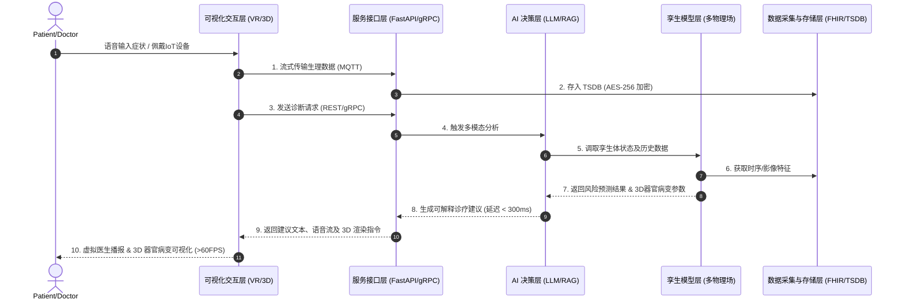

# 数字孪生医生系统详细设计文档 (Detailed Design Document)

## 1. 系统定位与边界界定
基于《数字孪生2型糖尿病+心脑血管医生系统架构设计》文档，本“数字孪生医生”系统定位为**集“超写实交互(Avatar)”、“多模态感知”、“深度医疗推理(Agent)”与“个体化生理建模(Twin)”于一体的综合智能辅助决策与随访中枢**。

**系统边界：**
- **数据域**：合法获取授权的 EHR、可穿戴物联网设备（IoT）数据及多模态影像（DICOM），不主动抓取无关隐私。
- **决策域**：系统性质为 CDSS（临床辅助决策支持系统），提供高置信度的诊断参考、风险分层与治疗方案模拟，**最终处方权归属执业医师**。

## 2. 核心能力定义
1. **实时同步患者生理数据**：毫秒级摄取心电、血压、动态血糖（CGM）等 IoT 流数据，维持孪生体的状态一致性。
2. **基于 AI 模型的诊疗建议**：结合大语言模型（LLM）与医学知识图谱（RAG），针对当前症状输出多维度、可解释的诊断及用药意见。
3. **多场景回放与预测模拟**：支持“时间轴穿梭”（回顾历史发病期生理切片）及“反事实推演”（模拟更换降糖药/降压药后 10 年的心脑血管事件发生率）。
4. **可视化交互界面**：在 3D 虚拟医生之上，增加器官级（如心脏、血管斑块）的 3D 渲染，支持 VR/AR 沉浸式会诊与医患沟通。

## 3. 技术选型与模块划分

### 3.1 数据采集层 (Data Ingestion Layer)
- **核心组件**：EMQX (MQTT Broker), HAPI FHIR Server, DCMTK.
- **技术规格**：
  - 支持 HL7 v2/v3 及 FHIR R4 标准进行院内 HIS/EMR 数据对接。
  - 支持 DICOM 3.0 协议拉取及解析医学影像。
  - 使用 MQTT 及 OPC-UA 协议实现高频（100Hz+）IoT 传感器（如动态心电图）的流式摄取。

### 3.2 数字孪生模型层 (Digital Twin Model Layer)
- **核心组件**：SciML (PINNs 物理信息神经网络), ODE/PDE 求解器。
- **技术规格**：
  - 采用**多物理场耦合建模**：融合血流动力学（0D/1D血管网络）与代谢动力学（葡萄糖-胰岛素闭环）。
  - 混合建模：结合机理模型（ODE）与机器学习（数据驱动），确保在缺失部分特征时仍能保持泛化能力。

### 3.3 AI 决策层 (AI Decision Layer)
- **核心组件**：PyTorch, TensorRT, vLLM (推理引擎), Milvus (向量库).
- **技术规格**：
  - 深度学习诊疗算法：使用 Transformer 及 Graph Neural Networks (GNN) 分析时序特征及图谱关联。
  - **性能指标**：诊断意见置信度输出 $\ge 95\%$，通过 TensorRT 加速实现模型推理响应延迟 $\le 300$ ms。

### 3.4 服务接口层 (Service API Layer)
- **核心组件**：FastAPI (Python) + gRPC (C++/Go).
- **技术规格**：
  - 对外提供 RESTful API 及 gRPC 双重接口，全面兼容 FHIR 资源模型。
  - 基于 Kubernetes HPA 实现横向扩展。
  - **性能指标**：单实例并发处理能力 $\ge 1000$ TPS。

### 3.5 可视化与交互层 (UI/UX & Visualization Layer)
- **核心组件**：WebRTC, Three.js / WebXR, Unreal Engine (Pixel Streaming).
- **技术规格**：
  - 3D 器官级渲染：基于 WebGL 渲染心脏脉动与血管斑块透视。
  - XR 支持：提供 WebXR API，支持头显设备（如 Meta Quest）进行 VR/AR 沉浸式多学科会诊 (MDT)。
  - **性能指标**：渲染帧率 $\ge 60$ FPS，音视频及指令端到端延迟 $\le 100$ ms。

## 4. 数据治理与安全合规方案

### 4.1 数据加密与脱敏
- **静态存储 (Data at Rest)**：所有数据库（PostgreSQL, TSDB）采用 **AES-256** 卷级加密及字段级加密。
- **传输加密 (Data in Transit)**：内网与公网通信强制要求 **mTLS 1.3** 双向认证。
- **数据脱敏**：采用 K-Anonymity (K-匿名) 与 L-Diversity 算法对姓名、身份证、联系方式等 PHI（个人健康信息）进行哈希掩码处理。

### 4.2 合规标准
- **国内合规**：全面满足《网络安全法》、《数据安全法》、《个人信息保护法》要求，系统架构按照**等保 3.0 三级**标准设计（物理隔离、严格鉴权、审计日志留存 $\ge 6$ 个月）。
- **国际合规**：符合 **HIPAA** (Health Insurance Portability and Accountability Act) 隐私及安全准则。

## 5. 核心业务数据流图 (Sequence Diagram)

