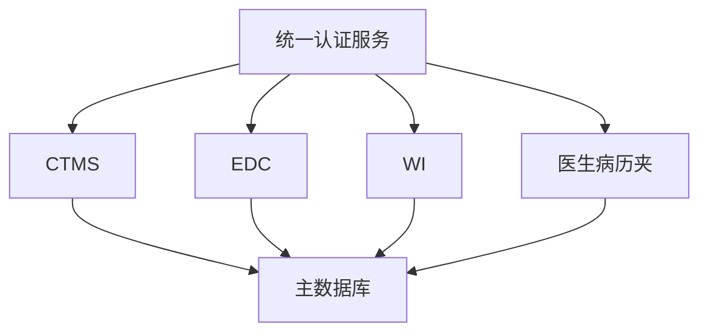

## 项目规划：临床试验管理系统（CTMS/EDC/IWRS/病历夹）

### 1. 项目概述

根据需求文档，需要构建一个一体化的临床试验管理系统，整合四个核心模块：
- CTMS（临床试验管理系统）
- EDC（电子数据采集系统）
- IWRS（交互式随机化与药物供应管理系统）
- 医生个人病历夹系统

所有系统集成在单个数据库上运行，实现数据统一管理，支持模块间集成与安全控制。

### 2. 核心要求

#### 2.1 数据库要求
- 所有模块共用同一个数据库（PostgreSQL）
- 采用CDISC标准的数据结构
- 数据库统一认证和权限控制

#### 2.2 登录系统要求
- 每个大系统有单独登录页面（CTMS、EDC、IWRS）
- 存在一个统一登录页面，用户可以选择访问不同系统
- 统一认证服务（认证服务模块）

#### 2.3 数据流向要求
- 医生日历夹资料可以从EDC系统导入（仅支持单向导入）
- EDC系统不能从医生病历夹导入数据
- EDC模板可以导入医生病历夹
- 所有数据权限受控（RBAC）

### 3. 技术实现方案

### 3.1 系统架构


### 3.2 模块功能划分

#### 3.2.1 统一认证服务
- 用户认证（JWT、OAuth2）
- 单点登录（SSO）
- 基于角色的访问控制（RBAC）

#### 3.2.2 CTMS模块
- 临床试验全生命周期管理
- 中心管理
- 工时管理
- 文档管理

#### 3.2.3 EDC模块
- eCRF设计
- 数据采集
- 核查规则
- SDTM导出

#### 3.2.4 IWRS模块
- 随机化算法配置
- 药物供应管理
- 破盲管理

#### 3.2.5 医生日历夹模块
- 患者数据管理
- 拖拉拽式表单设计
- 模板复用
- 患者数据导入（限EDC）

### 4. 数据流设计

#### 4.1 数据导入流程
1. EDC → 病历夹：患者数据从EDC系统导入到病历夹（单向）
2. EDC模板 → 病历夹：模板可以导入到病历夹系统
3. 病历夹 → EDC：不允许数据反向导入

#### 4.2 权限控制
- 用户必须有相应权限才能访问系统
- 数据访问加上行级权限控制
- 医疗敏感数据字段加密存储
- 审计日志记录

### 5. 项目结构设计

```
smartDr/
├── backend/
│   ├── auth-service/     # 统一认证服务
│   ├── ctms-service/     # CTMS服务
│   ├── edc-service/      # EDC服务
│   ├── iwrs-service/     # IWRS服务
│   ├── patient-folder-service/  # 病历夹服务
│   ├── common/           # 公共组件
│   └── database/         # 数据库配置及脚本
├── frontend/
│   ├── auth/             # 统一登录页
│   ├── ctms/             # CTMS前端
│   ├── edc/              # EDC前端
│   ├── iwrs/             # IWRS前端
│   ├── patient-folder/   # 病历夹前端
│   └── shared/           # 共享UI组件
├── api/
│   └── docs/             # API文档
└── config/
    └── database/         # 数据库配置
```

### 6. 安全和合规性

#### 6.1 安全要求
- 数据库字段级加密（患者姓名、身份证号、联系方式）
- 审计日志：记录所有关键操作
- 异常登录检测
- 动态脱敏：低权限用户查看时实时脱敏

#### 6.2 合规要求
- 符合21 CFR Part 11
- 符合GDPR和HIPAA
- 符合CDISC标准
- 支持电子签名认证

### 7. 交付里程碑

#### 7.1 Phase 1：基础设施与认证
- 数据库设计和部署
- 核心认证服务
- 基础权限系统

#### 7.2 Phase 2：核心模块开发
- CTMS和EDC核心功能
- 模块间数据交互接口实现
- 基础表单设计器

#### 7.3 Phase 3：增强功能开发
- IWRS系统
- 医生日历夹
- 安全与审计功能
- 系统集成功能

### 8. 数据库设计方案（关键表结构）

#### 8.1 用户相关
```
users: 用户表（包含身份信息、密码、权限等）
roles: 角色表（定义不同角色权限）
user_roles: 用户角色关联表
```

#### 8.2 医疗数据结构
```
patients: 患者信息表
clinical_trials: 临床试验表
study_sites: 研究中心表
forms: 表单模板表
form_data: 表单数据表
```

#### 8.3 数据导入/导出配置
```
data_import_records: 导入记录
data_export_records: 导出记录
```

### 9. 登录流程设计

#### 9.1 统一登录页面
- 用户通过统一登录页访问各系统
- 登录后可通过菜单导航到具体模块
- 支持SSO自动跳转

#### 9.2 各模块单独登录
- CTMS、EDC、IWRS、病历夹都有独立的登录入口
- 所有登录校验由统一认证服务完成
- 不同模块有不同页面引导

### 10. 数据流向控制

#### 10.1 正确数据流向
```
[EDC系统] --> [医生病历夹]
[EDC模板] --> [医生病历夹]
```

#### 10.2 限制数据流向
```
[医生病历夹] --禁止--> [EDC系统]
```

### 11. 关键特性实现
- 拖拉拽式eCRF设计
- CDISC标准支持
- 多租户支持
- SaaS化部署能力
- 异步数据导入导出机制
- 审计追踪系统

## 结论
本系统设计实现了一个功能完整的临床试验管理平台，所有模块集成在同一数据库中，具有清晰的用户权限体系和安全措施。通过统一的认证服务和模块间接口设计，实现了各子系统之间的有效集成，同时满足了患者数据只能从EDC导入病历夹的要求。