# 医疗临床试验平台 - 数据库 ER 图设计

## 一、整体 ER 图架构

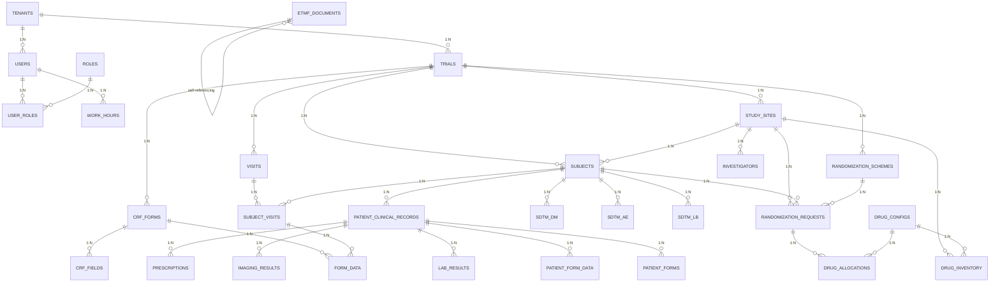

---

## 二、租户与用户管理 ER 图

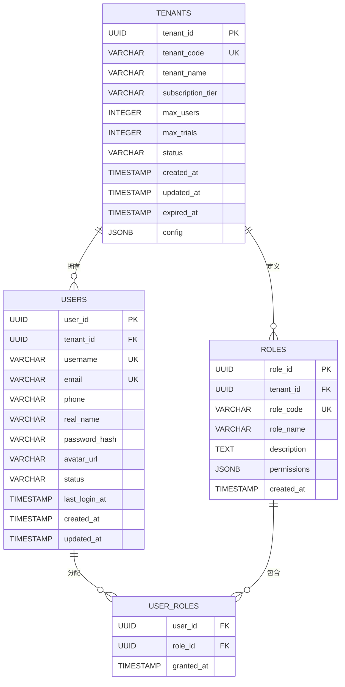

---

## 三、CTMS 模块 ER 图

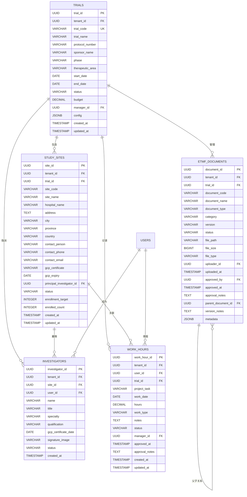

---

## 四、EDC 模块 ER 图

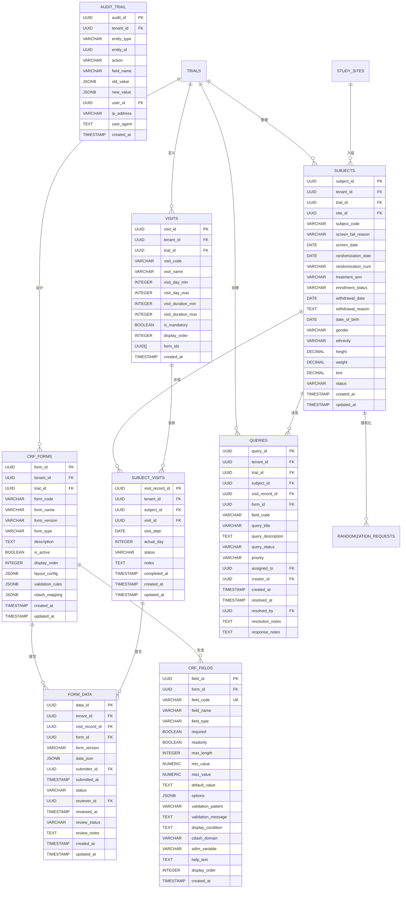

---

## 五、SDTM 数据模型 ER 图

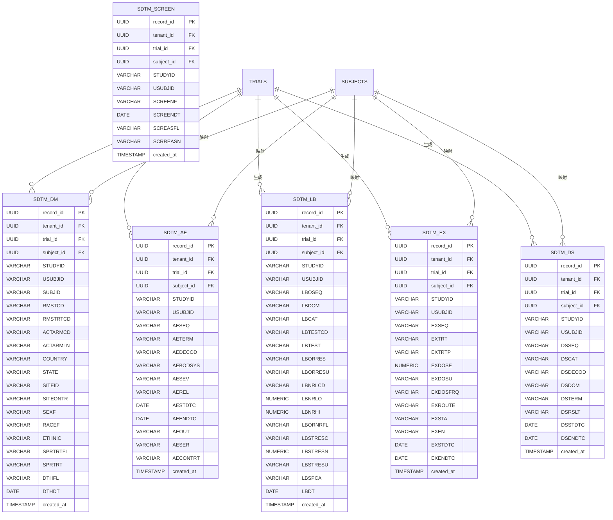

---

## 六、IWRS 模块 ER 图

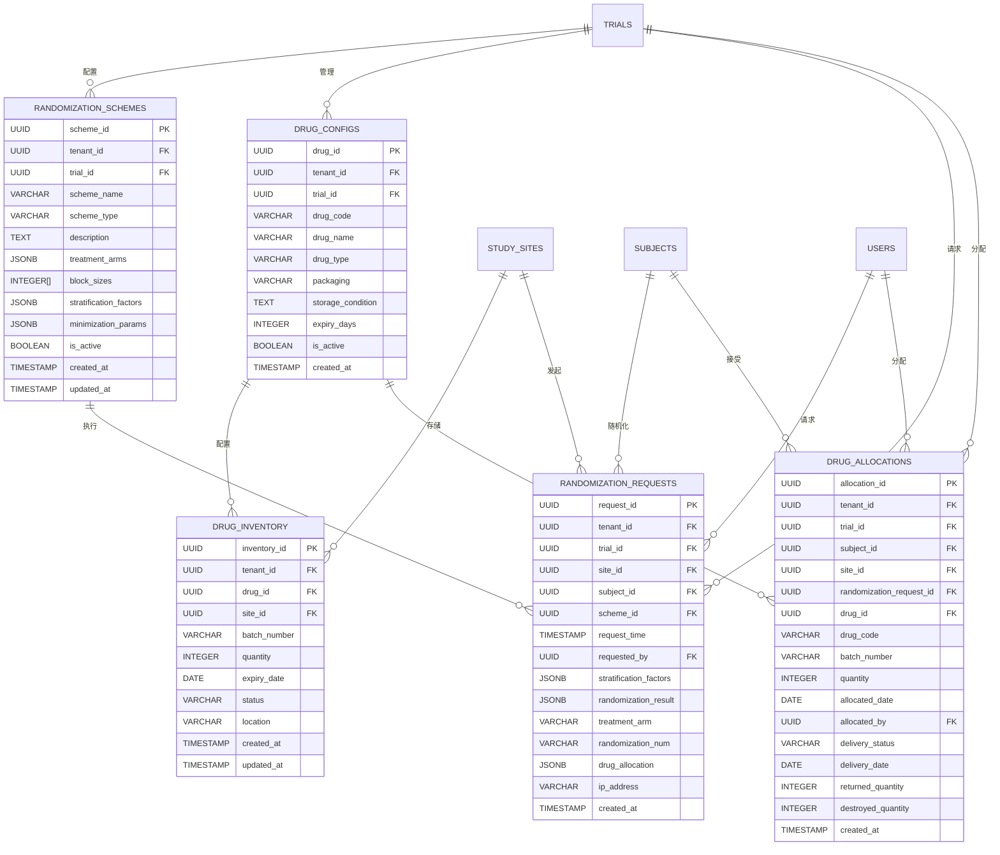

---

## 七、医生病历夹模块 ER 图

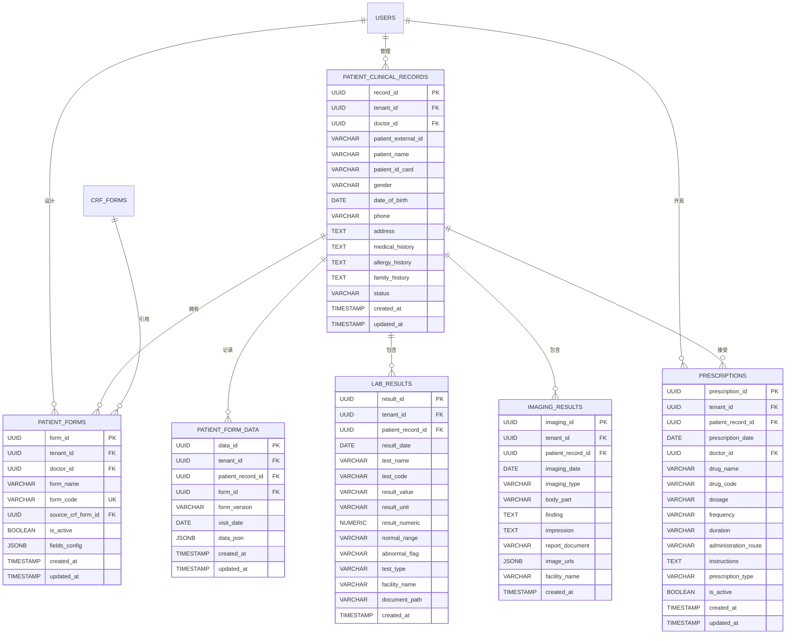

---

## 八、数据验证与审计 ER 图

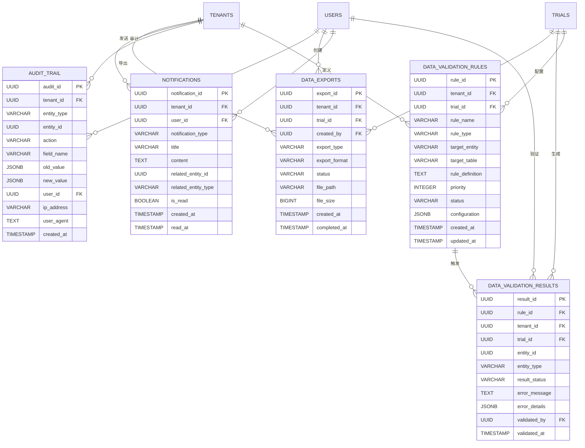

---

## 九、数据库关系详细说明

### 9.1 租户隔离策略

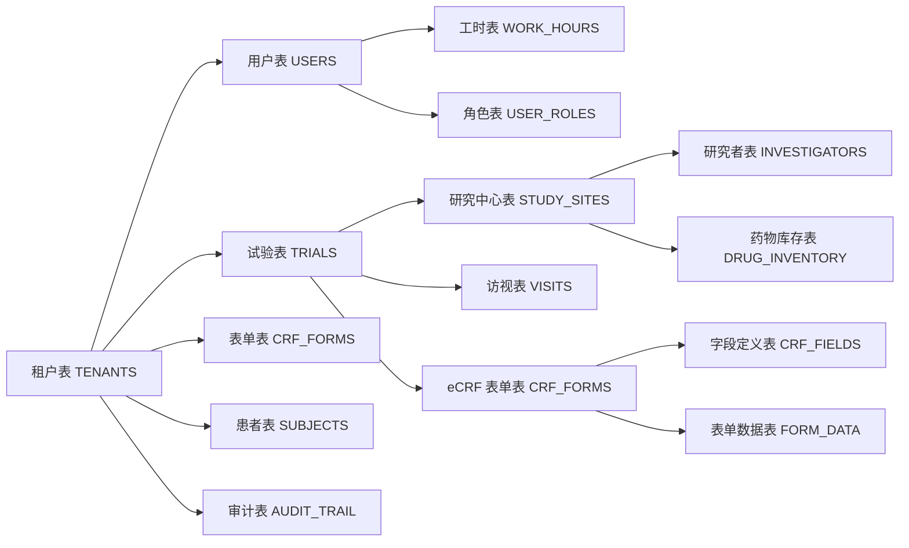

**租户隔离机制:**
1. **Schema 隔离**: 每个租户独立的 PostgreSQL Schema
2. **行级安全**: 所有业务表包含 `tenant_id` 字段
3. **查询过滤**: 所有查询自动过滤 `tenant_id`
4. **权限控制**: 租户间数据完全隔离

### 9.2 核心业务流程 ER 关系

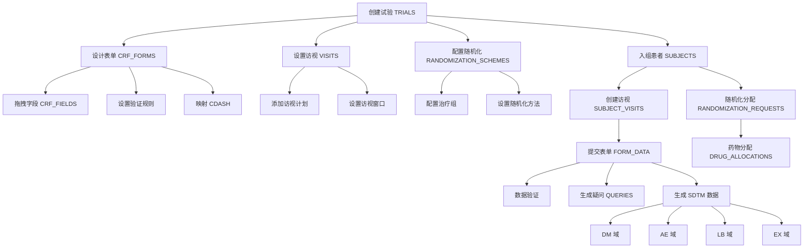

---

## 十、索引优化设计

```sql
-- 租户隔离索引
CREATE INDEX idx_tenant_all ON tenants(tenant_id);
CREATE INDEX idx_subjects_tenant ON subjects(tenant_id);
CREATE INDEX idx_forms_tenant ON crf_forms(tenant_id);
CREATE INDEX idx_data_tenant ON form_data(tenant_id);
CREATE INDEX idx_audit_tenant ON audit_trail(tenant_id);

-- 查询性能索引
CREATE INDEX idx_subjects_trial ON subjects(trial_id);
CREATE INDEX idx_subjects_site ON subjects(site_id);
CREATE INDEX idx_subject_visits_subject ON subject_visits(subject_id);
CREATE INDEX idx_form_data_visit ON form_data(visit_record_id);
CREATE INDEX idx_form_data_form ON form_data(form_id);
CREATE INDEX idx_visits_trial ON visits(trial_id);
CREATE INDEX idx_schemes_trial ON randomization_schemes(trial_id);
CREATE INDEX idx_requests_subject ON randomization_requests(subject_id);

-- SDTM 数据索引
CREATE INDEX idx_sdtm_dm_trial ON sdtm_dm(trial_id, subject_id);
CREATE INDEX idx_sdtm_ae_trial ON sdtm_ae(trial_id, subject_id);
CREATE INDEX idx_sdtm_lb_trial ON sdtm_lb(trial_id, subject_id);
CREATE INDEX idx_sdtm_ex_trial ON sdtm_ex(trial_id, subject_id);
CREATE INDEX idx_sdtm_ds_trial ON sdtm_ds(trial_id, subject_id);

-- 全文搜索索引
CREATE INDEX idx_trial_name ON trials USING gin(to_tsvector('chinese', trial_name));
CREATE INDEX idx_site_name ON study_sites USING gin(to_tsvector('chinese', site_name));
CREATE INDEX idx_patient_name ON patient_clinical_records USING gin(to_tsvector('chinese', patient_name));

-- 复合索引
CREATE INDEX idx_subject_trial_site ON subjects(trial_id, site_id, status);
CREATE INDEX idx_form_data_status ON form_data(status, updated_at);
CREATE INDEX idx_queries_status ON queries(status, created_at);
CREATE INDEX idx_work_hours_date ON work_hours(work_date, user_id);
```

---

## 十一、数据备份与归档策略

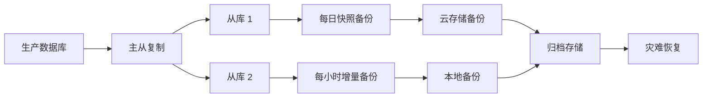

**备份策略:**
- **实时**: 主从复制
- **每小时**: 增量备份
- **每日**: 全量备份
- **每月**: 归档到冷存储
- **保留期**: 生产数据 7 年（符合 GCP 要求）

---

## 十二、ER 图图例说明

```
实体表示:
┌─────────────────┐
│ 表名             │
├─────────────────┤
│ 字段 1           │
│ 字段 2           │
│ ...              │
└─────────────────┘

关系表示:
1:N - 一对多关系
1:1 - 一对一关系
M:N - 多对多关系 (通过关联表)
self-referencing - 自引用关系
```

---

*文档版本：v1.0*
*创建日期：2026 年*
*维护人：蔡宇恒*
