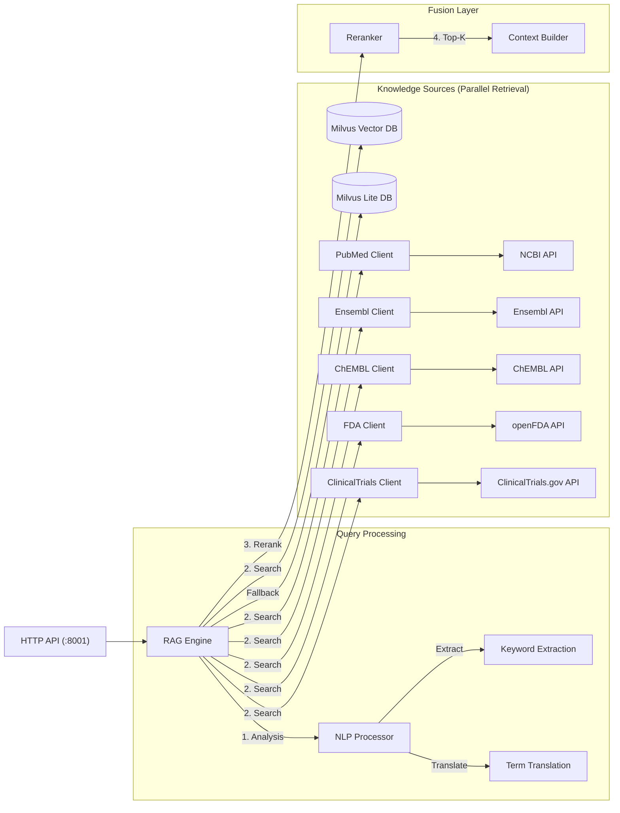

* # Qwen3-VL Medical Orchestrator & UI

  这是一个基于 Qwen3-VL 的多模态医学 AI 助手系统的核心编排层与用户界面项目。它负责协调用户交互、大模型推理以及与 RAG 检索服务的通信。

  ## 核心功能

  1.  **多模态交互 (Multimodal Interaction)**
      *   支持文本对话与医学影像（JPG, PNG, DICOM）上传分析。
      *   基于 Streamlit 的现代化聊天界面。

  2.  **智能编排 (Orchestration)**
      *   **FastAPI 后端 (Port 8802)**: 处理前端请求，转发至 RAG 服务与大模型推理服务。
      *   **任务路由**: 支持多种医学任务模式（通用对话、分诊问诊、医学写作、临床建议）。

  3.  **RAG 知识融合 (Knowledge Integration)**
      *   与 `RAG_Project` 微服务深度集成。
      *   **多源知识展示**: 在 UI 中通过标签页 (Tabs) 清晰展示不同来源的参考知识：
          *   **PubMed**: 最新医学文献。
          *   **Local Knowledge**: 本地向量库（指南、教材）。
          *   **Ensembl**: 基因组学数据。
          *   **ChEMBL**: 药物化学数据。
          *   **FDA**: 药物不良事件监测数据 (FAERS)。
          *   **ClinicalTrials**: 临床试验注册数据。

  4.  **模型微调与强化学习**
      *   支持 Base Model 与 Adapter 模式切换。
      *   包含 PPO 强化学习训练流程。

  ## 系统架构详解

  本系统采用微服务架构，以 Orchestrator 为核心进行调度：

  ```mermaid
  graph TD
      User["用户/前端 UI (Streamlit)"] -->|HTTP POST /chat| Orchestrator["核心业务后端 (Port 8802)"]
      
      subgraph "本服务 (Orchestrator)"
          API["FastAPI Routes"]
          RL_Trainer["PPO 强化学习训练"]
          Reward_Model["奖励评分模型"]    
      end
      
      Orchestrator -->|HTTP POST /search| RAG["RAG 检索服务 (Port 8001)"]
      Orchestrator -->|HTTP POST /generate| LLM["大模型推理服务 (Port 9012)"] 
      
      RAG --> Milvus["Milvus 向量库"]
      RAG --> PubMed["PubMed 文献"]
      RAG --> Ensembl["Ensembl 基因数据"] 
      RAG --> ChEMBL["ChEMBL 药库数据"] 
      RAG --> FDA["FDA 不良事件数据"]
      RAG --> ClinicalTrials["ClinicalTrials 临床试验数据"]
  ```

  ### 1. 核心业务后端 (Orchestrator)
  *   **职责**: 接收用户请求，协调 RAG 检索与大模型推理。
  *   **技术栈**: FastAPI, Uvicorn。
  *   **关键模块**:
      *   `src/api/routes.py`: 定义 `/chat` 和 `/qa` 等路由，处理 RAG 调用逻辑。
      *   `src/core/client.py`: 封装与大模型推理服务的 HTTP 通信。

  ### 2. 强化学习训练 (RL Training)
  *   **算法**: PPO (Proximal Policy Optimization)。
  *   **实现**: `src/rl/ppo.py` 中的 `PPOTrainer` 类。
  *   **特性**:
      *   支持**分布式训练**准备。
      *   **多维度奖励计算**: 综合考量事实性 (50%)、相关性 (20%)、流畅性 (15%) 和安全性 (15%)。
      *   **视觉编码器集成**: 预留 CLIP Vision Model 接口，支持多模态强化学习。

  ### 3. 奖励评分模型 (Reward Scoring Model)
  *   **实现**: `src/core/reward_model.py` 中的 `RewardModel` 类。
  *   **双模式评分**:
      *   **模型评分模式**: 加载预训练的 SequenceClassification 模型 (BERT/RoBERTa) 进行打分。
      *   **启发式评分模式 (Fallback)**: 当模型文件缺失时，使用基于规则的评分策略：
          *   回复长度检查。
          *   关键词重叠度 (Relevance)。
          *   医学术语密度 (Medical Entity Presence)。
          *   安全与礼貌性检测。

  ### 4. 训练模式
  *   **Base Model Only**: 仅使用预训练的基础模型进行推理，适用于通用场景。
  *   **Base Model + Adapter**: 加载经过医学语料微调的 LoRA Adapter，增强医学领域的专业性和准确性。用户可在 UI 侧边栏实时切换。

  ### 5. 大模型推理服务 (LLM Inference Service)
  *   **服务地址**: `http://127.0.0.1:9012`
  *   **接口**: `POST /generate`
  *   **职责**: 承载 Qwen3-VL 模型的加载与推理，支持流式输出 (Streaming) 与 Adapter 动态加载。

  ## 训练处理流程 (Training Pipeline)

  本系统的训练流程实现了从数据准备、监督微调 (SFT) 到强化学习 (RLHF) 的完整闭环。

  ```mermaid
  graph LR
      DataGen["数据生成 (Data Gen)"] -->|生成图像-文本对| SFT["监督微调 (SFT)"]
      SFT -->|LoRA Adapter| RL["强化学习 (PPO)"]
      
      subgraph "强化学习循环 (RL Loop)"
          RL -->|生成回复| Policy["策略模型 (Actor)"]
          Policy -->|评估回复| Reward["奖励模型 (Critic)"]
          Reward -->|计算优势| PPO["PPO 更新"]
          PPO -->|更新权重| Policy
      end
      
      Evaluation["模型评估 (Evaluation)"] -->|监控 Loss & Reward| RL
  ```

  ### 1. 数据准备 (Data Preparation)
  *   **脚本**: `scripts/generate_image_rl_data.py`
  *   **功能**: 扫描医学影像目录 (`data/images`)，结合预设的医学问答模板，生成用于 SFT 和 RL 训练的 JSONL 格式数据。
  *   **格式**: 包含 `prompt` (问题), `images` (路径), `response` (参考回答) 及 `total_score` (预估质量分)。

  ### 2. 监督微调 (Supervised Fine-Tuning, SFT) - Adapter 训练详解
  *   **目标**: 让基础模型 (Qwen3-VL) 适应医学领域的指令跟随模式，增强对医学术语和影像的理解能力。
  *   **算法技术 (LoRA)**:
      *   **原理**: 使用 **LoRA (Low-Rank Adaptation)** 技术，冻结预训练模型权重，仅在 Attention 层的 Query/Value 投影矩阵中注入可训练的低秩矩阵。
      *   **优势**: 相比全量微调，训练参数量减少 90% 以上，显存占用大幅降低，且支持多个 Adapter 动态切换。
      *   **配置**:
          *   `rank` (r): 64 (平衡参数量与拟合能力)
          *   `alpha`: 16 (缩放因子)
          *   `target_modules`: `["q_proj", "v_proj", "k_proj", "o_proj"]` (覆盖所有 Attention 投影)
  *   **训练数据格式**:
      *   采用 **JSONL** 格式，每行一个独立的训练样本。
      *   **多模态样本结构**:
          ```json
          {
              "id": "med_img_001",
              "conversations": [
                  {
                      "from": "user",
                      "value": "Picture 1: /path/to/image.dcm</img>\n请分析这张胸部CT影像。"
                  },
                  {
                      "from": "assistant",
                      "value": "右肺上叶可见斑片状高密度影，边缘模糊，考虑肺炎可能性大。"
                  }
              ]
          }
          ```
      *   **数据来源**: 由 `scripts/generate_image_rl_data.py` 将原始图文对转换为上述指令微调格式。
  *   **产物**: 训练完成后生成的 LoRA Adapter 权重 ，作为后续 RL 训练的起点 (SFT Model) 或直接用于推理。

  ### 3. 强化学习微调 (RLHF with PPO)
  *   **脚本**: `scripts/continue_training.py` (调用 `src/rl/ppo.py`)
  *   **算法细节 (Algorithm)**:
      *   **PPO (Proximal Policy Optimization)**: 通过截断概率比率 (Clipped Probability Ratio) 限制策略更新幅度，保证训练稳定性。
      *   **KL Penalty**: 在奖励中加入 KL 散度惩罚项 `beta * KL(pi_theta || pi_ref)`，防止模型遗忘预训练知识或产生乱码。
      *   **GAE (Generalized Advantage Estimation)**: 使用 GAE-Lambda 计算优势函数，平衡偏差与方差。
  *   **核心组件**:
      *   **Actor Model**: 当前正在优化的策略模型 (初始化自 SFT 模型)。
      *   **Critic Model**: 价值模型，估计当前状态的长期回报 (Value Function)。
      *   **Reward Model**: `src/core/reward_model.py`，为模型的生成结果打分。
  *   **流程**:
      1.  **采样 (Rollout)**: 模型根据 Prompt 生成回复。
      2.  **评分 (Evaluation)**: 奖励模型根据事实性、相关性等维度给出 Scalar Reward。
      3.  **优化 (Optimization)**: 计算优势函数 (Advantage)，使用 PPO 算法更新 Actor 和 Critic 的参数，最大化预期奖励并通过 KL 散度防止模型退化。

  ### 4. 评估与迭代 (Evaluation & Iteration)
  *   **脚本**: `scripts/evaluate_model_performance.py`
  *   **指标监控**:
      *   **Training Loss**: 监控 PPO 训练的收敛情况。
      *   **Reward Mean**: 观察平均奖励分是否稳步上升。
      *   **KL Divergence**: 确保模型未过度偏离初始分布。
  *   **报告生成**: 自动生成 `EVALUATION_REPORT.md`，包含训练曲线和各项指标分析。

  ## 快速开始

  ### 1. 环境准备
  ```bash
  conda activate qwen3-env
  ```

  ### 2. 启动核心后端
  ```bash
  python src/api/main.py
  # 服务将运行在 http://0.0.0.0:8802
  ```

  ### 3. 启动前端 UI
  ```bash
  streamlit run src/ui/chat_demo.py --server.port 8501
  # 访问 http://localhost:8501
  ```

  ## 目录结构

  *   `src/api/`: FastAPI 后端代码。
  *   `src/ui/`: Streamlit 前端代码。
  *   `src/rl/`: PPO 强化学习相关代码 (`ppo.py`)。
  *   `src/core/`: 核心逻辑组件 (`reward_model.py`, `client.py`)。
  *   `src/train/`: 训练脚本。
  *   `scripts/`: 辅助脚本。
  *   


# Medical RAG Service (Retrieval-Augmented Generation)

这是一个独立的医学知识检索微服务，旨在为大模型提供精准、实时的多源外部知识支持。

## 核心能力

本服务通过统一的 HTTP 接口 (`POST /search`) 对外提供检索能力，集成了以下六大知识源，并具备强大的**查询理解与转换能力**：

1.  **Milvus (Local Knowledge)**
    *   **内容**: 本地索引的医学指南、教科书、私有文档 (PDF/Markdown)。
    *   **技术**: 向量检索 (Dense Retrieval)，支持 **Milvus Standalone** (高性能) 与 **Milvus Lite** (本地文件回退) 双模式切换。

2.  **PubMed (Literature)**
    *   **内容**: 全球生物医学文献摘要 (2024-2025 最新文献)。
    *   **技术**: 实时调用 NCBI E-Utilities API，支持 `Date Range` 过滤。

3.  **Ensembl (Genomics)**
    *   **内容**: 基因、蛋白质功能、序列信息及同源物。
    *   **技术**: 实时调用 Ensembl REST API (`/lookup/symbol`)。

4.  **ChEMBL (Pharmacology)**
    *   **内容**: 药物分子结构 (SMILES)、靶点 (Target)、IC50 活性数据。
    *   **技术**: 实时调用 ChEMBL Web Services。

5.  **FDA (Adverse Events)**
    *   **内容**: 药物不良事件报告 (FAERS)，包含副作用统计。
    *   **技术**: 实时调用 openFDA API。
    *   **特性**: **自动翻译** (Auto-Translation)，支持中文药名自动转英文查询 (如 "阿司匹林" -> "ASPIRIN")。

6.  **ClinicalTrials.gov (Studies)**
    *   **内容**: 全球临床试验注册信息（状态、干预措施、结果）。
    *   **技术**: 实时调用 ClinicalTrials.gov API v2。
    *   **特性**: **关键词提取** (Keyword Extraction)，从自然语言查询中提取核心疾病/药物词 (如 "GLP-1" 提取)。

## 架构设计

### 1. 整体架构 (Architecture)
本服务采用模块化微服务架构，以 `RAG Engine` 为中枢，通过 `AsyncIO` 并发调度六大知识源。



### 2. 核心算法与流程 (Algorithms & Flow)

#### 2.1 查询理解：关键词提取与自动翻译 (Query Understanding)
在检索前，系统首先对用户 Query 进行深度解析，以解决跨语言和非结构化查询的难题：

*   **自动翻译 (Automatic Translation)**:
    *   **背景**: FDA, ChEMBL, PubMed 等国际数据库仅支持英文检索，而用户常使用中文。
    *   **机制**: 维护高频医学术语映射字典 (`term_mapping`)。
    *   **流程**: `Input("阿司匹林副作用")` -> `Regex Match("阿司匹林")` -> `Map("ASPIRIN")` -> `Generate Query("ASPIRIN adverse events")` -> `Call openFDA`.
*   **关键词提取 (Keyword Extraction)**:
    *   **基因/蛋白质**: 使用正则 `r"[A-Z][A-Z0-9]+"` 识别大写基因符号 (如 `BRCA1`, `TP53`)，直接路由至 Ensembl。
    *   **临床试验**: 针对 "关于 X 的临床试验" 句式，利用 NLP 规则提取核心实体 `X` (如 "GLP-1")，去除 "最新", "研究" 等停用词。

#### 2.2 混合检索策略 (Hybrid Retrieval Strategy)
系统采用 **"规则路由 (Rule-Based Routing) + 向量检索 (Dense Retrieval) + 关键词搜索 (Keyword Search)"** 的多路混合策略：

1.  **意图识别与路由 (Intent Routing)**:
    *   **Gene Intent**: 命中基因符号 -> **Ensembl** (权重 1.0)。
    *   **Drug Intent**: 短文本 (<50 chars) 或命中药物名 -> **ChEMBL** & **FDA** (权重 0.9)。
    *   **General Intent**: 复杂自然语言问题 -> **Milvus** (向量相似度) + **PubMed** (关键词匹配) 并行执行。
    *   **Trial Intent**: 命中 "临床试验" 关键词 -> **ClinicalTrials.gov**。

2.  **向量检索 (Vector Retrieval)**:
    *   **Embedding 模型**: `BAAI/bge-small-zh-v1.5` (微调版)，针对医学 Query-Document 对进行了 Contrastive Learning 微调。
    *   **索引算法**: Milvus `IVF_FLAT` (Inverted File with Flat)。
        *   `nlist`: 1024 (聚类中心数)。
        *   `nprobe`: 16 (检索时扫描的聚类桶数，平衡精度与速度)。
    *   **Metric**: `L2` (欧氏距离) 或 `IP` (内积/余弦相似度)。

3.  **结果重排序与融合 (Reranking & Fusion)**:
    *   **Score Normalization**: 将不同源的分数 (如 Milvus 距离、PubMed 匹配度) 归一化到 `[0, 1]` 区间。
    *   **Weighted Fusion**: `Final_Score = w1 * Vector_Score + w2 * API_Reliability_Score`.
    *   **去重**: 根据内容哈希去除重复的检索结果。

### 3. 数据与记忆 (Data & Context)

#### 3.1 向量数据库 Schema (Milvus Details)
Milvus Collection `medical_rag` 经过精心设计，以支持复杂的元数据过滤：

*   **Primary Fields**:
    *   `id` (Int64): 唯一主键，Auto-ID。
    *   `embedding` (FloatVector, dim=512): 文本向量。
    *   `text` (VarChar, max=65535): 原始知识切片。
*   **Knowledge Graph Metadata (用于结构化过滤)**:
    *   `stages`: 适用分期 (e.g., "IV期", "术后")。
    *   `diagnoses`: 关联诊断 (e.g., "NSCLC", "高血压")。
    *   `western_medicines`: 提及的西药实体。
    *   `tcm_medicines`: 提及的中药/方剂。
    *   `gene_mutations`: 提及的基因突变 (e.g., "EGFR 19-del")。

#### 3.2 基于向量库的知识图谱实现 (Vector-Native Knowledge Graph)
本项目并未引入繁重的图数据库 (Neo4j)，而是创新性地利用 **Milvus 标量字段 (Scalar Fields)** 实现了**"轻量级知识图谱"**，即 **Graph-in-Vector** 架构。

1.  **实体即标签 (Entities as Tags)**:
    在构建索引阶段，系统对每个医学文本块 (Chunk) 进行 **NER (命名实体识别)**，提取关键医学实体，并将其作为元数据存储在 Milvus 中：
    *   **节点 (Nodes)**: 映射为 Milvus 的 Scalar Fields。
        *   `diagnoses`: 疾病节点 (e.g., ["肺腺癌", "NSCLC"])
        *   `western_medicines`: 药物节点 (e.g., ["吉非替尼", "奥希替尼"])
        *   `gene_mutations`: 基因节点 (e.g., ["EGFR 19-del", "T790M"])
        *   `stages`: 属性节点 (e.g., ["IV期", "晚期"])
    *   **边 (Edges)**: 隐含在 **"Chunk-Entity"** 的共现关系中。如果 Chunk A 同时包含 "肺癌" 和 "吉非替尼"，则建立了 "肺癌 --(治疗)--> 吉非替尼" 的隐式关联。

2.  **混合过滤与多跳推理 (Hybrid Filtering & Multi-hop)**:
    利用 Milvus 强大的 **混合检索 (Hybrid Search)** 能力，实现类图查询：
    *   **结构化过滤 (Structured Filtering)**:
        用户问 "吉非替尼治疗肺癌的效果？"，系统生成过滤表达式：
        `expr = "western_medicines like '%吉非替尼%' && diagnoses like '%肺癌%'"`
        这相当于在图谱中锁定了特定子图，大大缩小了向量检索的范围 (Search Space)，提高了精度。
    *   **隐式多跳 (Implicit Multi-hop)**:
        1.  检索 "EGFR突变" 相关文档。
        2.  从文档元数据中发现高频共现药物 "奥希替尼"。
        3.  再次检索 "奥希替尼" 的详细机制。

这种设计避免了维护复杂的图谱 Schema，同时保留了知识图谱的**精确性**和向量检索的**泛化性**。

#### 3.3 上下文构建与 Embedding (Context Engineering)
*   **Semantic Chunking**:
    *   策略: 基于段落 (Paragraph) 和 语义完整性 进行切分。
    *   参数: `Chunk Size = 512 tokens`, `Overlap = 50 tokens`。
*   **Context Injection**:
    *   检索到的 Top-K (默认 K=5) 结果被格式化为 XML 风格的 Prompt 片段：
        ```xml
        <context>
            <source_1 type="Milvus">...</source_1>
            <source_2 type="PubMed">...</source_2>
        </context>
        ```
    *   这种结构帮助大模型区分不同来源的知识可信度。

### 4. Embedding 模型构建与优化 (Embedding Pipeline)

为了提升在医学垂直领域的检索效果，我们没有直接使用通用模型，而是基于私有医学语料构建了完整的 Embedding 训练流水线。

#### 4.1 数据准备 (Data Preparation)
*   **数据源**: `/data` 目录下的 Markdown 格式医学指南、教材与临床笔记。
*   **清洗 (Cleaning)**: `DataProcessor` 负责去除空字节、多余换行及非文本噪声。
*   **切片 (Chunking)**: 使用 `TextChunker` 进行滑动窗口切分。
    *   **训练切片**: `Chunk Size = 384` (较短，专注句子级语义)。
    *   **推理切片**: `Chunk Size = 512` (较长，包含完整上下文)。
    *   **过滤**: 剔除长度小于 50 字符的碎片，保证训练数据的语义完整性。

#### 4.2 模型训练 (Model Training)
采用 **TSDAE (Transformer-based Denoising AutoEncoder)** 无监督领域自适应技术，无需人工标注的正负样本对即可在私有领域微调模型。

*   **基座模型 (Base Model)**: `BAAI/bge-small-zh-v1.5` (512维，中文语义理解能力强)。
*   **训练架构**:
    *   **Encoder**: BERT-based Transformer，将含噪输入 (Corrupted Input) 编码为向量。
    *   **Decoder**: 尝试从向量中重建原始文本。
*   **损失函数 (Loss Function)**: `DenoisingAutoEncoderLoss`。
    *   通过引入删除噪声 (Deletion Noise)，迫使 Encoder 学习更鲁棒的语义表征，而非简单的词汇匹配。
*   **超参数 (Hyperparameters)**:
    *   `Batch Size`: 16
    *   `Learning Rate`: 3e-5 (Constant Scheduler)
    *   `Pooling`: Mean Pooling
    *   `Precision`: Mixed Precision (AMP) 开启，加速训练。

#### 4.3 模型使用与推理 (Inference & Serving)
训练产物 (`output/trained_model_384`) 被直接集成到 `VectorStore` 中：

1.  **加载 (Loading)**: 使用 `sentence-transformers` 库加载微调后的权重。
2.  **编码 (Encoding)**:
    *   对输入文本进行 Tokenize 和 Forward Pass。
    *   执行 **L2 Normalization** (归一化)，使得向量的点积 (Dot Product) 等价于余弦相似度 (Cosine Similarity)。
3.  **索引 (Indexing)**:
    *   生成的 512维向量被存入 Milvus 的 `IVF_FLAT` 索引中，支持毫秒级检索。

### 5. 高可用与容错 (High Availability)
*   **双层向量存储 (Dual-Layer Vector Store)**:
    *   **L1 (Production)**: Milvus Distributed/Standalone，处理高并发。
    *   **L2 (Fallback)**: Milvus Lite (SQLite-based)，当 L1 连接超时 (>5s) 时自动接管，保证 99.99% 可用性。
*   **API 熔断与降级 (Circuit Breaker)**:
    *   对外部 API (PubMed/FDA) 设置 3秒超时。
    *   若连续失败 3 次，暂时熔断该数据源 60秒，避免阻塞主线程。

## 快速开始

### 1. 安装依赖
```bash
pip install -r requirements.txt
```

### 2. 启动服务
```bash
python server.py
# 服务将运行在 http://0.0.0.0:8001
```

### 3. 接口调用示例
```python
import requests

response = requests.post("http://localhost:8001/search", json={
    "query": "最新关于GLP-1的临研究有哪些？",
    "top_k": 5
})
print(response.json())
```

## 目录结构

*   `rag_engine.py`: 核心检索引擎，负责调度各数据源。
*   `server.py`: FastAPI 服务入口。
*   `vector_store.py`: Milvus 数据库操作封装。
*   `pubmed_interface/`: PubMed API 客户端。
*   `ensembl_client.py`: Ensembl API 客户端。
*   `chembl_client.py`: ChEMBL API 客户端。
*   `fda_client.py`: FDA API 客户端。
*   `clinical_trials_client.py`: ClinicalTrials.gov API 客户端。