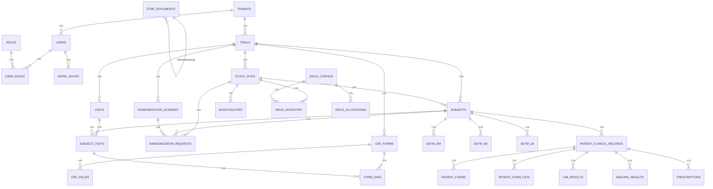

# 医疗临床试验平台 - 完整产品设计文档

## 文档说明

本文件包含医疗临床试验 SaaS 平台的完整产品设计，包括：
1. 四个系统的完整功能清单
2. 详细的技术设计文档
3. eCRF 表单设计器 UI 原型
4. CDISC 标准映射规则详解
5. 数据库 ER 图
6. API 接口详细文档
7. PostgreSQL 数据库设计

**项目信息:**
- 项目名称：医疗临床试验管理平台
- 文档版本：v1.0
- 创建日期：2026 年
- 维护人：蔡宇恒
- 文件位置：`d:\workspace\doc\clinical-trial-platform-complete-design.md`

---

## 目录

1. [系统概述](#第一部分-系统概述)
2. [四个系统完整功能](#第二部分-四个系统完整功能)
3. [详细技术设计](#第三部分-详细技术设计)
4. [eCRF 表单设计器 UI 原型](#第四部分-ecrf-表单设计器-ui-原型)
5. [CDISC 标准映射规则](#第五部分-cdisc-标准映射规则详解)
6. [数据库 ER 图](#第六部分-数据库-er-图)
7. [API 接口文档](#第七部分-api-接口详细文档)
8. [实施计划](#第八部分-实施计划)

---

# 第一部分 - 系统概述

## 1.1 项目背景

随着中国医疗行业的快速发展，临床试验管理需求日益增长。本项目旨在构建一个符合国际标准的临床试验 SaaS 平台，服务于中国药企、CRO 公司和医疗机构。

## 1.2 产品定位

面向中国医疗市场的临床试验全流程 SaaS 系统，包含四大核心模块：
1. **CTMS** - 临床试验管理系统
2. **EDC** - 电子数据采集系统
3. **IWRS** - 交互式随机应答系统
4. **医生个人患者病历夹**

## 1.3 核心特色

### 1.3.1 符合国际标准
- **CDISC 标准**: 数据采集 (CDASH)、数据模型 (SDTM)、分析数据 (ADaM)
- **合规要求**: FDA 21 CFR Part 11、GCP、NMPA
- **数据导出**: 支持 Define.xml、SDTM 格式

### 1.3.2 技术架构
- **微服务架构**: 可扩展、易维护
- **多租户设计**: PostgreSQL 多 Schema 隔离
- **统一数据库**: 所有系统共享，数据一致
- **SaaS 部署**: 云端部署，按需使用

### 1.3.3 用户体验
- **拖拽式表单设计**: 可视化设计，无需编码
- **CDASH 智能映射**: 自动映射标准字段
- **多语言支持**: 中英文界面
- **响应式设计**: 支持 PC、平板、移动端

---

# 第二部分 - 四个系统完整功能

## 2.1 CTMS（临床试验管理系统）

### 2.1.1 试验项目管理

**功能列表:**
- 试验创建与规划
  - 试验基本信息：名称、方案编号、申办方、研究类型（I-IV 期）
  - 试验阶段管理：启动期、入组期、治疗期、随访期、结束期
  - 时间线规划：关键里程碑设置与追踪
  - 预算规划：各阶段预算分配与控制
  - 资源分配：人员、设备、场地分配

- 项目看板
  - 可视化项目进度仪表板
  - 关键指标监控：入组率、数据完成率、问题数
  - 风险预警机制
  - 甘特图展示

- 文档管理（eTMF 集成）
  - 核心文档库：方案、知情同意书、investigator brochure
  - 文档版本控制
  - 文档审批工作流
  - 文档模板管理

### 2.1.2 中心管理 (Site Management)

**功能列表:**
- 中心信息管理
  - 研究中心基本信息：名称、地址、联系方式
  - 中心资质信息：GCP 资质、伦理委员会批准
  - 研究者信息：主要研究者（PI）、亚研究者（Sub-I）
  - 中心联系人管理

- 中心筛选与评估
  - 中心筛选标准配置
  - 中心评估打分
  - 中心实地考察记录
  - 中心启动状态管理

- 中心绩效监控
  - 入组速度监控
  - 数据质量评估
  - 研究中心排名
  - 绩效报告生成

### 2.1.3 eTMF（电子试验主文档）

**功能列表:**
- 文档在线编辑
  - 支持 Word、Excel、PDF 在线编辑
  - 文档版本对比
  - 修订痕迹追踪
  - 多人协作编辑

- 文档审批流程
  - 多级审批配置
  - 审批通知与提醒
  - 审批意见记录
  - 审批状态追踪

- 合规性检查
  - eTMF 标准检查（FDA 要求）
  - 文档完整性验证
  - 缺失文档预警
  - 合规性报告生成

- 文档分类与索引
  - ISTAF 标准分类
  - 全文搜索
  - 标签管理
  - 文档关联

### 2.1.4 工时管理系统

**功能列表:**
- 工时填报
  - 按项目/任务填报工时
  - 工时类型：开发、测试、会议、培训等
  - 日报/周报/月报
  - 工时附件上传

- 工时审核
  - 多级审核流程
  - 审核意见记录
  - 审核状态追踪
  - 异常工时预警

- 资源管理
  - 项目人员配置
  - 人员技能标签
  - 资源利用率分析
  - 人员负荷监控

- 工时统计与分析
  - 项目工时汇总
  - 部门工时统计
  - 成本核算
  - 效率分析报告

### 2.1.5 协作沟通

**功能列表:**
- 任务管理
  - 任务创建与分配
  - 任务优先级设置
  - 任务到期提醒
  - 任务进度追踪

- 消息通知
  - 系统内消息
  - 邮件通知
  - 短信提醒
  - 微信通知（可选）

- 讨论区
  - 项目讨论组
  - 话题管理
  - 评论互动
  - 文件共享

## 2.2 EDC（电子数据采集系统）

### 2.2.1 eCRF 表单设计器

**功能列表:**
- 拖拽式设计界面
  - 可视化表单画布
  - 表单元素拖拽放置
  - 实时预览功能
  - 多表单支持（问卷式、步骤式）

- 字段类型库
  - 文本字段：单行、多行
  - 数值字段：整数、浮点数
  - 日期时间字段：日期、时间、日期时间
  - 选择字段：下拉选择、单选按钮、多选框
  - 医学字段：体检项目、实验室结果、不良事件
  - 图片字段：图片上传、签名
  - 逻辑字段：计算字段、条件显示

- CDASH 标准映射
  - 字段英文名自动验证
  - 字段中文名支持
  - CDASH 标准字段库
  - 字段属性配置（必填、只读、可选）
  - 数据域映射（Visit、Param、Timing 等）

- 逻辑验证规则
  - 必填字段校验
  - 数据范围校验
  - 逻辑一致性校验（如：结束日期>=开始日期）
  - 交叉验证（不同页面/表单间）
  - 自定义规则配置（公式、脚本）

- 表单版本管理
  - 表单版本历史
  - 版本差异对比
  - 版本回滚
  - 已录入数据迁移

### 2.2.2 数据录入界面

**功能列表:**
- 患者数据录入
  - 患者选择/创建
  - 访视管理（Screening、Baseline、Visit1、Visit2...）
  - 表单填写引导
  - 自动填充（基于历史数据）
  - 草稿保存

- 数据录入工作流
  - 数据录入员分配
  - 数据审核流程（双人录入、单录入双审核）
  - 数据锁定机制
  - 数据解锁审批

- 疑问 (Query) 管理
  - 疑问创建与分配
  - 疑问状态追踪（Open、Resolved、Closed）
  - 疑问与数据行关联
  - 疑问沟通记录
  - 批量疑问处理

- 数据审核
  - 审核检查点配置
  - 数据质量规则
  - 审核意见记录
  - 审核报告生成

### 2.2.3 数据管理功能

**功能列表:**
- 数据导入/导出
  - 支持 Excel、CSV 导入
  - CDISC SDTM 格式导出
  - ADaM 格式导出
  - Define.xml 导出
  - 数据验证预览

- 数据验证引擎
  - 内置验证规则库
  - 自定义验证规则
  - 批量数据验证
  - 验证报告生成
  - 异常数据标记

- 数据质量监控
  - 数据完整性检查
  - 数据一致性检查
  - 异常值检测
  - 趋势分析报告
  - 数据质量仪表板

- 审计追踪 (Audit Trail)
  - 所有数据操作记录
  - 操作人、时间、IP 记录
  - 修改前后值对比
  - 不可篡改存储
  - 符合 21 CFR Part 11

### 2.2.4 数据标准支持

**功能列表:**
- CDISC 标准实现
  - CDASH 数据采集标准
  - SDTM 数据模型
  - ADaM 分析数据模型
  - Define.xml 元数据

- SDTM 数据库设计
  - 标准域表：DM、SD、CE、EX、GS、LB、AE、DS、ST 等
  - 标准变量命名
  - 标准值集管理
  - SDTM 验证工具

- 映射规则
  - eCRF 字段 → SDTM 变量映射
  - 数据转换规则
  - 衍生变量计算
  - 映射文档自动生成

### 2.2.5 高级功能

**功能列表:**
- 电子签名
  - 符合 21 CFR Part 11
  - 签名绑定
  - 签名验证
  - 批量签名

- 多语言支持
  - 中英文界面切换
  - 多语言表单支持
  - 自动翻译
  - 语言包管理

- 权限管理
  - 角色定义（数据录入员、数据管理员、项目经理、监查员）
  - 细粒度权限控制
  - 数据访问控制
  - 操作权限控制

- 报告生成
  - 患者入组报告
  - 数据完成率报告
  - 数据质量报告
  - 进度跟踪报告
  - 自定义报告

## 2.3 IWRS（交互式随机应答系统）

### 2.3.1 随机化设计

**功能列表:**
- 随机化方法
  - 简单随机化
  - 分层随机化（按中心、疾病严重程度等分层）
  - 区组随机化 (Block Randomization)
  - 动态自适应随机化
  - 最小化法 (Minimization)

- 随机化方案配置
  - 治疗组配置（对照组、试验组 A、试验组 B...）
  - 分配比例配置（1:1, 2:1, 3:1 等）
  - 区组大小设置
  - 分层因素设置
  - 随机种子管理

- 随机化表管理
  - 随机化表生成
  - 随机化表查看（仅限授权人员）
  - 随机化表冻结
  - 随机化表变更审批

### 2.3.2 药物管理

**功能列表:**
- 药物库存管理
  - 药物编码管理
  - 药物批次管理
  - 药物库存数量管理
  - 药物有效期管理
  - 药物预警（库存不足、即将过期）

- 药物分配
  - 基于随机化结果分配药物
  - 药物配送管理
  - 药物接收确认
  - 药物使用记录

- 药物回收与销毁
  - 剩余药物回收
  - 药物销毁记录
  - 回收数量核对
  - 销毁审批流程

### 2.3.3 入组流程

**功能列表:**
- 受试者管理
  - 受试者筛选
  - 入组/排除标准检查
  - 知情同意书签署确认
  - 受试者编号分配（符合 ICH GCP）

- 随机化分配
  - 实时随机化请求
  - 随机化结果返回
  - 分配结果记录
  - 随机化不可逆保证

- 入组状态跟踪
  - 入组进度监控
  - 入组率统计
  - 入组预测分析
  - 入组瓶颈识别

- 入组流程自动化
  - 自动检查入组标准
  - 自动分配随机号
  - 自动通知相关人员
  - 自动更新入组状态

### 2.3.4 药物供应管理

**功能列表:**
- 药物供应预测
  - 基于入组预测的药物需求
  - 中心级别药物需求预测
  - 时间维度需求预测
  - 预警机制

- 药物供应计划
  - 药物采购计划
  - 药物调拨计划
  - 物流跟踪
  - 到货确认

- 药物使用记录
  - 每次用药记录
  - 用药依从性计算
  - 药物消耗统计
  - 药物使用偏差分析

### 2.3.5 接口集成

**功能列表:**
- 与 EDC 集成
  - 受试者信息同步
  - 入组状态同步
  - 数据一致性保证
  - 双向数据流

- 与 CTMS 集成
  - 中心信息同步
  - 项目进度同步
  - 资源分配同步

- 外部系统接口
  - 短信平台接口
  - 邮件服务器接口
  - 医院 HIS 系统接口（可选）

## 2.4 医生个人患者病历夹

### 2.4.1 患者数据管理

**功能列表:**
- 患者档案管理
  - 患者基本信息录入
  - 患者照片管理
  - 患者关联试验/项目
  - 患者生命周期管理

- 诊疗记录
  - 病史采集
  - 体格检查记录
  - 诊断记录
  - 治疗方案记录
  - 随访记录

- 检查结果整合
  - 实验室检查（血液、尿液等）
  - 影像学检查（CT、MRI、X 光等）
  - 病理检查报告
  - 基因检测结果
  - 检查结果趋势图

- 药物处方管理
  - 处方开具
  - 用药记录
  - 用药依从性追踪
  - 药物相互作用检查

### 2.4.2 自定义表单设计

**功能列表:**
- 拖拽式表单设计器
  - 与 EDC 表单设计器相同界面
  - 个人化表单创建
  - 表单模板库
  - 表单版本管理

- 引用 EDC 模板
  - 直接从 EDC 导入表单模板
  - 模板自定义修改
  - 模板版本同步
  - 模板共享管理

- 个人化字段
  - 医生自定义字段
  - 患者自定义字段
  - 自由文本字段
  - 多媒体字段（照片、视频）

- 表单逻辑
  - 条件显示
  - 必填校验
  - 数据计算
  - 数据关联

### 2.4.3 数据隐私与安全

**功能列表:**
- 患者数据脱敏
  - 自动脱敏规则
  - 手动脱敏操作
  - 脱敏级别设置
  - 脱敏审计

- 访问权限控制
  - 医生权限（只能看自己的患者）
  - 患者授权管理
  - 访问日志记录
  - 异常访问预警

- 数据加密
  - 传输加密（HTTPS/TLS）
  - 存储加密（AES-256）
  - 密钥管理
  - 加密审计

- 数据备份与恢复
  - 自动备份
  - 手动备份
  - 恢复测试
  - 备份策略配置

### 2.4.4 医生工作台

**功能列表:**
- 患者列表
  - 患者列表筛选（按试验、入组时间、状态等）
  - 患者状态标记
  - 快速导航
  - 批量操作

- 待办事项
  - 待录入数据提醒
  - 待审核事项
  - 待处理疑问
  - 随访提醒

- 数据概览
  - 患者关键数据汇总
  - 数据完整性统计
  - 异常数据提醒
  - 趋势分析

- 快捷操作
  - 快速录入
  - 快速搜索
  - 快捷报告
  - 常用模板

### 2.4.5 高级功能

**功能列表:**
- 数据可视化
  - 患者时间线
  - 关键指标趋势图
  - 实验室结果趋势
  - 用药记录时间轴

- 智能提醒
  - 随访时间提醒
  - 数据录入提醒
  - 异常数据提醒
  - 重要日期提醒（生日、anniversary 等）

- 数据导出
  - 患者报告导出（PDF）
  - 数据导出（Excel、CSV）
  - 统计报告导出
  - 自定义导出模板

- 多端支持
  - Web 端（医生工作台）
  - 移动端（医生 APP）
  - 平板适配
  - PDA 支持（可选）

---

# 第三部分 - 详细技术设计

## 3.1 系统架构

### 3.1.1 架构图

```
┌─────────────────────────────────────────────────────────────────┐
│                        API 网关层                                │
│  (Kong/Nginx + JWT 认证 + 限流 + 日志)                            │
└─────────────────────────┬───────────────────────────────────────┘
                          │
┌─────────────────────────┼───────────────────────────────────────┐
│                      服务注册中心                              │
│                   (Nacos)                                      │
└─────────────────────────┬───────────────────────────────────────┘
                          │
┌─────────────────────────┼───────────────────────────────────────┐
│                      微服务层                                   │
│  ┌──────────┐  ┌──────────┐  ┌──────────┐  ┌──────────┐       │
│  │ CTMS 服务 │  │ EDC 服务  │  │ IWRS 服务 │  │ 病历夹服务 │       │
│  │          │  │          │  │          │  │          │       │
│  │ 试验管理  │  │ 表单设计  │  │ 随机化   │  │ 患者管理  │       │
│  │ 中心管理  │  │ 数据录入  │  │ 药物管理  │  │ 诊疗记录  │       │
│  │ eTMF     │  │ 数据验证  │  │ 入组流程  │  │ 自定义表单│       │
│  │ 工时管理  │  │ 审计追踪  │  │          │  │          │       │
│  └──────────┘  └──────────┘  └──────────┘  └──────────┘       │
│         │            │            │            │                │
│         └────────────┴────────────┴────────────┘                │
└─────────────────────────┬───────────────────────────────────────┘
                          │
┌─────────────────────────┼───────────────────────────────────────┐
│                    数据访问层                                    │
│         (MyBatis-Plus + 多租户隔离 + 连接池)                     │
└─────────────────────────┬───────────────────────────────────────┘
                          │
┌─────────────────────────┼───────────────────────────────────────┐
│                   PostgreSQL 数据库                              │
│  (多租户 Schema + 行级安全 + 读写分离)                          │
└─────────────────────────────────────────────────────────────────┘
```

### 3.1.2 技术栈选型

#### 后端技术栈
- **开发语言**: Java 17
- **微服务框架**: Spring Boot 3.x + Spring Cloud Alibaba
- **服务注册/配置**: Nacos
- **API 网关**: Spring Cloud Gateway
- **服务调用**: OpenFeign
- **熔断降级**: Sentinel
- **日志追踪**: SkyWalking
- **ORM 框架**: MyBatis-Plus
- **数据库**: PostgreSQL 15+
- **缓存**: Redis 7.x
- **消息队列**: RabbitMQ / Kafka

#### 前端技术栈
- **框架**: React 18 + TypeScript
- **UI 库**: Ant Design 5
- **状态管理**: Zustand
- **HTTP 客户端**: Axios
- **表单库**: React Hook Form
- **数据可视化**: ECharts
- **拖拽库**: React DnD

#### DevOps 工具
- **容器化**: Docker + Kubernetes
- **CI/CD**: Jenkins / GitLab CI
- **监控**: Prometheus + Grafana
- **日志**: ELK Stack (Elasticsearch + Logstash + Kibana)
- **代码质量**: SonarQube

## 3.2 数据库设计

### 3.2.1 多租户架构

#### 租户隔离策略

```sql
-- 方案 1: Schema 隔离（推荐）
CREATE SCHEMA tenant_001;
CREATE SCHEMA tenant_002;
-- 每个租户独立 Schema，数据完全隔离

-- 方案 2: 行级隔离
CREATE TABLE patients (
    tenant_id UUID NOT NULL,
    patient_id BIGSERIAL,
    -- ... 其他字段
    PRIMARY KEY (tenant_id, patient_id)
);
```

#### 推荐的 PostgreSQL 多租户实现

```sql
-- 启用行级安全 (RLS)
ALTER TABLE patients ENABLE ROW LEVEL SECURITY;

-- 创建 RLS 策略
CREATE POLICY tenant_isolation ON patients
    USING (tenant_id = current_setting('app.current_tenant')::uuid);

-- 设置租户上下文
SET app.current_tenant = 'uuid-here';
```

### 3.2.2 核心表结构

#### 租户与用户表

```sql
-- 租户表
CREATE TABLE tenants (
    tenant_id UUID PRIMARY KEY DEFAULT gen_random_uuid(),
    tenant_code VARCHAR(50) UNIQUE NOT NULL,  -- 租户编码
    tenant_name VARCHAR(100) NOT NULL,        -- 租户名称
    subscription_tier VARCHAR(50),            -- 订阅级别
    max_users INTEGER DEFAULT 10,             -- 最大用户数
    max_trials INTEGER DEFAULT 5,             -- 最大试验数
    status VARCHAR(20) DEFAULT 'active',      -- 状态
    created_at TIMESTAMP DEFAULT CURRENT_TIMESTAMP,
    updated_at TIMESTAMP DEFAULT CURRENT_TIMESTAMP,
    expired_at TIMESTAMP,                     -- 到期时间
    config JSONB DEFAULT '{}'                 -- 租户配置
);

-- 用户表
CREATE TABLE users (
    user_id UUID PRIMARY KEY DEFAULT gen_random_uuid(),
    tenant_id UUID NOT NULL,
    username VARCHAR(50) UNIQUE NOT NULL,
    email VARCHAR(100) UNIQUE NOT NULL,
    phone VARCHAR(20),
    real_name VARCHAR(50),
    password_hash VARCHAR(255) NOT NULL,
    avatar_url VARCHAR(500),
    status VARCHAR(20) DEFAULT 'active',      -- active, inactive, locked
    last_login_at TIMESTAMP,
    created_at TIMESTAMP DEFAULT CURRENT_TIMESTAMP,
    updated_at TIMESTAMP DEFAULT CURRENT_TIMESTAMP,
    FOREIGN KEY (tenant_id) REFERENCES tenants(tenant_id) ON DELETE CASCADE
);

-- 角色表
CREATE TABLE roles (
    role_id UUID PRIMARY KEY DEFAULT gen_random_uuid(),
    tenant_id UUID NOT NULL,
    role_code VARCHAR(50) UNIQUE NOT NULL,
    role_name VARCHAR(50) NOT NULL,
    description TEXT,
    permissions JSONB DEFAULT '[]',           -- 权限列表
    created_at TIMESTAMP DEFAULT CURRENT_TIMESTAMP,
    FOREIGN KEY (tenant_id) REFERENCES tenants(tenant_id) ON DELETE CASCADE
);

-- 用户角色关联表
CREATE TABLE user_roles (
    user_id UUID NOT NULL,
    role_id UUID NOT NULL,
    granted_at TIMESTAMP DEFAULT CURRENT_TIMESTAMP,
    PRIMARY KEY (user_id, role_id),
    FOREIGN KEY (user_id) REFERENCES users(user_id) ON DELETE CASCADE,
    FOREIGN KEY (role_id) REFERENCES roles(role_id) ON DELETE CASCADE
);
```

#### CTMS 核心表

```sql
-- 试验项目表
CREATE TABLE trials (
    trial_id UUID PRIMARY KEY DEFAULT gen_random_uuid(),
    tenant_id UUID NOT NULL,
    trial_code VARCHAR(50) UNIQUE NOT NULL,   -- 试验编号
    trial_name VARCHAR(200) NOT NULL,         -- 试验名称
    protocol_number VARCHAR(100),             -- 方案编号
    sponsor_name VARCHAR(200),                -- 申办方
    phase VARCHAR(20),                        -- I, II, III, IV期
    therapeutic_area VARCHAR(100),            -- 治疗领域
    start_date DATE,
    end_date DATE,
    status VARCHAR(20) DEFAULT 'planning',    -- planning, active, completed, paused
    budget DECIMAL(15, 2),
    manager_id UUID,
    config JSONB DEFAULT '{}',                -- 试验配置
    created_at TIMESTAMP DEFAULT CURRENT_TIMESTAMP,
    updated_at TIMESTAMP DEFAULT CURRENT_TIMESTAMP,
    FOREIGN KEY (tenant_id) REFERENCES tenants(tenant_id) ON DELETE CASCADE,
    FOREIGN KEY (manager_id) REFERENCES users(user_id)
);

-- 研究中心表
CREATE TABLE study_sites (
    site_id UUID PRIMARY KEY DEFAULT gen_random_uuid(),
    tenant_id UUID NOT NULL,
    trial_id UUID NOT NULL,
    site_code VARCHAR(50) NOT NULL,           -- 中心编号
    site_name VARCHAR(200) NOT NULL,          -- 中心名称
    hospital_name VARCHAR(200),               -- 医院名称
    address TEXT,                             -- 详细地址
    city VARCHAR(50),
    province VARCHAR(50),
    country VARCHAR(50) DEFAULT 'China',
    contact_person VARCHAR(50),
    contact_phone VARCHAR(20),
    contact_email VARCHAR(100),
    gcp_certificate VARCHAR(100),             -- GCP 证书编号
    gcp_expiry DATE,                          -- GCP 证书到期
    principal_investigator_id UUID,           -- 主要研究者
    status VARCHAR(20) DEFAULT 'pending',     -- pending, approved, inactive
    enrollment_target INTEGER,                -- 计划入组数
    enrolled_count INTEGER DEFAULT 0,         -- 已入组数
    created_at TIMESTAMP DEFAULT CURRENT_TIMESTAMP,
    updated_at TIMESTAMP DEFAULT CURRENT_TIMESTAMP,
    FOREIGN KEY (tenant_id) REFERENCES tenants(tenant_id) ON DELETE CASCADE,
    FOREIGN KEY (trial_id) REFERENCES trials(trial_id) ON DELETE CASCADE,
    FOREIGN KEY (principal_investigator_id) REFERENCES users(user_id)
);

-- 研究者表
CREATE TABLE investigators (
    investigator_id UUID PRIMARY KEY DEFAULT gen_random_uuid(),
    tenant_id UUID NOT NULL,
    site_id UUID NOT NULL,
    user_id UUID,
    name VARCHAR(50) NOT NULL,
    title VARCHAR(100),                       -- 职称
    specialty VARCHAR(100),                   -- 专业
    qualification VARCHAR(100),               -- 资质
    gcp_certificate_date DATE,                -- GCP 培训日期
    signature_image VARCHAR(500),             -- 签名图片
    status VARCHAR(20) DEFAULT 'active',
    created_at TIMESTAMP DEFAULT CURRENT_TIMESTAMP,
    FOREIGN KEY (tenant_id) REFERENCES tenants(tenant_id) ON DELETE CASCADE,
    FOREIGN KEY (site_id) REFERENCES study_sites(site_id) ON DELETE CASCADE,
    FOREIGN KEY (user_id) REFERENCES users(user_id) ON DELETE SET NULL
);

-- eTMF 文档表
CREATE TABLE etmf_documents (
    document_id UUID PRIMARY KEY DEFAULT gen_random_uuid(),
    tenant_id UUID NOT NULL,
    trial_id UUID NOT NULL,
    document_code VARCHAR(50),
    document_name VARCHAR(200) NOT NULL,
    document_type VARCHAR(50),                -- 文档类型 (ISTAF 分类)
    category VARCHAR(50),                     -- 分类
    version VARCHAR(20) DEFAULT '1.0',
    status VARCHAR(20) DEFAULT 'draft',       -- draft, submitted, approved, archived
    file_path VARCHAR(500),
    file_size BIGINT,
    file_type VARCHAR(50),
    uploader_id UUID,
    uploaded_at TIMESTAMP DEFAULT CURRENT_TIMESTAMP,
    approved_by UUID,
    approved_at TIMESTAMP,
    approval_notes TEXT,
    parent_document_id UUID,                  -- 父文档 ID
    version_notes TEXT,
    metadata JSONB DEFAULT '{}',
    FOREIGN KEY (tenant_id) REFERENCES tenants(tenant_id) ON DELETE CASCADE,
    FOREIGN KEY (trial_id) REFERENCES trials(trial_id) ON DELETE CASCADE,
    FOREIGN KEY (uploader_id) REFERENCES users(user_id),
    FOREIGN KEY (approved_by) REFERENCES users(user_id),
    FOREIGN KEY (parent_document_id) REFERENCES etmf_documents(document_id)
);

-- 工时表
CREATE TABLE work_hours (
    work_hour_id UUID PRIMARY KEY DEFAULT gen_random_uuid(),
    tenant_id UUID NOT NULL,
    user_id UUID NOT NULL,
    trial_id UUID,
    project_task VARCHAR(100),                -- 任务描述
    work_date DATE NOT NULL,
    hours DECIMAL(4, 2) NOT NULL,             -- 工时
    work_type VARCHAR(50),                    -- 工作类型
    notes TEXT,
    status VARCHAR(20) DEFAULT 'pending',     -- pending, approved, rejected
    manager_id UUID,
    approved_at TIMESTAMP,
    approval_notes TEXT,
    created_at TIMESTAMP DEFAULT CURRENT_TIMESTAMP,
    updated_at TIMESTAMP DEFAULT CURRENT_TIMESTAMP,
    FOREIGN KEY (tenant_id) REFERENCES tenants(tenant_id) ON DELETE CASCADE,
    FOREIGN KEY (user_id) REFERENCES users(user_id) ON DELETE CASCADE,
    FOREIGN KEY (trial_id) REFERENCES trials(trial_id) ON DELETE SET NULL,
    FOREIGN KEY (manager_id) REFERENCES users(user_id)
);
```

#### EDC 核心表

```sql
-- 表单设计主表
CREATE TABLE crf_forms (
    form_id UUID PRIMARY KEY DEFAULT gen_random_uuid(),
    tenant_id UUID NOT NULL,
    trial_id UUID NOT NULL,
    form_code VARCHAR(50) NOT NULL,
    form_name VARCHAR(100) NOT NULL,
    form_version VARCHAR(20) DEFAULT '1.0',
    form_type VARCHAR(50),                    -- questionnaire, casebook
    description TEXT,
    is_active BOOLEAN DEFAULT TRUE,
    display_order INTEGER DEFAULT 0,
    layout_config JSONB DEFAULT '{}',         -- 布局配置
    validation_rules JSONB DEFAULT '[]',      -- 验证规则
    cdash_mapping JSONB DEFAULT '{}',         -- CDASH 映射
    created_at TIMESTAMP DEFAULT CURRENT_TIMESTAMP,
    updated_at TIMESTAMP DEFAULT CURRENT_TIMESTAMP,
    FOREIGN KEY (tenant_id) REFERENCES tenants(tenant_id) ON DELETE CASCADE,
    FOREIGN KEY (trial_id) REFERENCES trials(trial_id) ON DELETE CASCADE
);

-- 表单字段定义表
CREATE TABLE crf_fields (
    field_id UUID PRIMARY KEY DEFAULT gen_random_uuid(),
    form_id UUID NOT NULL,
    field_code VARCHAR(100) NOT NULL,         -- 字段编码 (CDASH 标准)
    field_name VARCHAR(100) NOT NULL,         -- 字段中文名
    field_type VARCHAR(50) NOT NULL,          -- text, number, date, select, radio, checkbox
    required BOOLEAN DEFAULT FALSE,
    readonly BOOLEAN DEFAULT FALSE,
    max_length INTEGER,
    min_value NUMERIC,
    max_value NUMERIC,
    default_value TEXT,
    options JSONB DEFAULT '[]',               -- 选项列表 (select/radio/checkbox)
    validation_pattern VARCHAR(200),          -- 正则验证
    validation_message TEXT,
    display_condition TEXT,                   -- 显示条件
    cdash_domain VARCHAR(50),                 -- CDASH 域
    sdtm_variable VARCHAR(100),               -- SDTM 变量名
    help_text TEXT,                           -- 帮助文本
    display_order INTEGER DEFAULT 0,
    created_at TIMESTAMP DEFAULT CURRENT_TIMESTAMP,
    FOREIGN KEY (form_id) REFERENCES crf_forms(form_id) ON DELETE CASCADE
);

-- 访视表
CREATE TABLE visits (
    visit_id UUID PRIMARY KEY DEFAULT gen_random_uuid(),
    tenant_id UUID NOT NULL,
    trial_id UUID NOT NULL,
    visit_code VARCHAR(50) NOT NULL,          -- 访视编码 (SCREENING, BASELINE, V1, V2...)
    visit_name VARCHAR(100) NOT NULL,         -- 访视名称
    visit_day_min INTEGER,                    -- 最小天数
    visit_day_max INTEGER,                    -- 最大天数
    visit_duration_min INTEGER,               -- 最小持续天数
    visit_duration_max INTEGER,               -- 最大持续天数
    is_mandatory BOOLEAN DEFAULT TRUE,        -- 是否必填
    display_order INTEGER DEFAULT 0,
    form_ids UUID[],                          -- 关联表单 ID 数组
    created_at TIMESTAMP DEFAULT CURRENT_TIMESTAMP,
    FOREIGN KEY (tenant_id) REFERENCES tenants(tenant_id) ON DELETE CASCADE,
    FOREIGN KEY (trial_id) REFERENCES trials(trial_id) ON DELETE CASCADE
);

-- 受试者表
CREATE TABLE subjects (
    subject_id UUID PRIMARY KEY DEFAULT gen_random_uuid(),
    tenant_id UUID NOT NULL,
    trial_id UUID NOT NULL,
    site_id UUID NOT NULL,
    subject_code VARCHAR(50) NOT NULL,        -- 受试者编号
    screen_fail_reason VARCHAR(200),          -- 筛选失败原因
    screen_date DATE,                         -- 筛选日期
    randomization_date DATE,                  -- 随机化日期
    randomization_num VARCHAR(50),            -- 随机号
    treatment_arm VARCHAR(50),                -- 治疗组
    enrollment_status VARCHAR(50),            -- enrolled, screened, withdrawn, completed
    withdrawal_date DATE,
    withdrawal_reason TEXT,
    date_of_birth DATE,
    gender VARCHAR(10),                       -- M, F, U
    ethnicity VARCHAR(50),
    height DECIMAL(5, 2),                     -- 身高 cm
    weight DECIMAL(5, 2),                     -- 体重 kg
    bmi DECIMAL(4, 2),
    status VARCHAR(20) DEFAULT 'screening',   -- screening, enrolled, active, completed, withdrawn
    created_at TIMESTAMP DEFAULT CURRENT_TIMESTAMP,
    updated_at TIMESTAMP DEFAULT CURRENT_TIMESTAMP,
    FOREIGN KEY (tenant_id) REFERENCES tenants(tenant_id) ON DELETE CASCADE,
    FOREIGN KEY (trial_id) REFERENCES trials(trial_id) ON DELETE CASCADE,
    FOREIGN KEY (site_id) REFERENCES study_sites(site_id) ON DELETE CASCADE
);

-- 访视记录表
CREATE TABLE subject_visits (
    visit_record_id UUID PRIMARY KEY DEFAULT gen_random_uuid(),
    tenant_id UUID NOT NULL,
    subject_id UUID NOT NULL,
    visit_id UUID NOT NULL,
    visit_date DATE,
    actual_day INTEGER,                       -- 实际第几天
    status VARCHAR(20) DEFAULT 'pending',     -- pending, completed, missed, skipped
    notes TEXT,
    completed_at TIMESTAMP,
    created_at TIMESTAMP DEFAULT CURRENT_TIMESTAMP,
    updated_at TIMESTAMP DEFAULT CURRENT_TIMESTAMP,
    FOREIGN KEY (tenant_id) REFERENCES tenants(tenant_id) ON DELETE CASCADE,
    FOREIGN KEY (subject_id) REFERENCES subjects(subject_id) ON DELETE CASCADE,
    FOREIGN KEY (visit_id) REFERENCES visits(visit_id) ON DELETE CASCADE
);

-- 表单数据表
CREATE TABLE form_data (
    data_id UUID PRIMARY KEY DEFAULT gen_random_uuid(),
    tenant_id UUID NOT NULL,
    visit_record_id UUID NOT NULL,
    form_id UUID NOT NULL,
    form_version VARCHAR(20) NOT NULL,
    data_json JSONB NOT NULL,                 -- 表单数据 (JSON 格式)
    submitter_id UUID,
    submitted_at TIMESTAMP,
    status VARCHAR(20) DEFAULT 'draft',       -- draft, submitted, locked
    reviewer_id UUID,
    reviewed_at TIMESTAMP,
    review_status VARCHAR(20),                -- pending, approved, rejected
    review_notes TEXT,
    created_at TIMESTAMP DEFAULT CURRENT_TIMESTAMP,
    updated_at TIMESTAMP DEFAULT CURRENT_TIMESTAMP,
    FOREIGN KEY (tenant_id) REFERENCES tenants(tenant_id) ON DELETE CASCADE,
    FOREIGN KEY (visit_record_id) REFERENCES subject_visits(visit_record_id) ON DELETE CASCADE,
    FOREIGN KEY (form_id) REFERENCES crf_forms(form_id) ON DELETE CASCADE,
    FOREIGN KEY (submitter_id) REFERENCES users(user_id),
    FOREIGN KEY (reviewer_id) REFERENCES users(user_id)
);

-- 审计追踪表
CREATE TABLE audit_trail (
    audit_id UUID PRIMARY KEY DEFAULT gen_random_uuid(),
    tenant_id UUID NOT NULL,
    entity_type VARCHAR(50) NOT NULL,         -- subjects, form_data, users 等
    entity_id UUID NOT NULL,
    action VARCHAR(50) NOT NULL,              -- CREATE, UPDATE, DELETE, VIEW
    field_name VARCHAR(100),
    old_value JSONB,
    new_value JSONB,
    user_id UUID NOT NULL,
    ip_address VARCHAR(50),
    user_agent TEXT,
    created_at TIMESTAMP DEFAULT CURRENT_TIMESTAMP,
    FOREIGN KEY (tenant_id) REFERENCES tenants(tenant_id) ON DELETE CASCADE,
    FOREIGN KEY (user_id) REFERENCES users(user_id)
);

-- 疑问 (Query) 表
CREATE TABLE queries (
    query_id UUID PRIMARY KEY DEFAULT gen_random_uuid(),
    tenant_id UUID NOT NULL,
    trial_id UUID NOT NULL,
    subject_id UUID NOT NULL,
    visit_record_id UUID,
    form_id UUID,
    field_code VARCHAR(100),
    query_title VARCHAR(200) NOT NULL,
    query_description TEXT NOT NULL,
    query_status VARCHAR(20) DEFAULT 'open',  -- open, resolved, closed
    priority VARCHAR(20) DEFAULT 'medium',    -- low, medium, high, urgent
    assigned_to UUID,                         -- 分配给谁
    creator_id UUID NOT NULL,
    created_at TIMESTAMP DEFAULT CURRENT_TIMESTAMP,
    resolved_at TIMESTAMP,
    resolved_by UUID,
    resolution_notes TEXT,
    response_notes TEXT,
    FOREIGN KEY (tenant_id) REFERENCES tenants(tenant_id) ON DELETE CASCADE,
    FOREIGN KEY (trial_id) REFERENCES trials(trial_id) ON DELETE CASCADE,
    FOREIGN KEY (subject_id) REFERENCES subjects(subject_id) ON DELETE CASCADE,
    FOREIGN KEY (visit_record_id) REFERENCES subject_visits(visit_record_id) ON DELETE SET NULL,
    FOREIGN KEY (form_id) REFERENCES crf_forms(form_id) ON DELETE SET NULL,
    FOREIGN KEY (assigned_to) REFERENCES users(user_id),
    FOREIGN KEY (creator_id) REFERENCES users(user_id),
    FOREIGN KEY (resolved_by) REFERENCES users(user_id)
);
```

#### SDTM 数据模型表

```sql
-- SDTM: 受试者特征 (Domain: DM)
CREATE TABLE sdtm_dm (
    record_id UUID PRIMARY KEY DEFAULT gen_random_uuid(),
    tenant_id UUID NOT NULL,
    trial_id UUID NOT NULL,
    subject_id UUID NOT NULL,
    -- 标准变量
    STUDYID VARCHAR(200),
    USUBJID VARCHAR(100),           -- 唯一受试者 ID
    SUBJID VARCHAR(50),             -- 受试者编号
    RMSTCD VARCHAR(10),             -- 随机化方法代码
    RMSTRTCD VARCHAR(10),           -- 随机化治疗代码
    ACTARMCD VARCHAR(10),           -- 实际治疗代码
    ACTARMLN VARCHAR(100),          -- 实际治疗描述
    COUNTRY VARCHAR(100),           -- 国家
    STATE VARCHAR(100),             -- 州/省
    SITEID VARCHAR(50),             -- 中心编号
    SITEONTR VARCHAR(100),          -- 中心名称
    SEXF VARCHAR(1),                -- 性别
    RACEF VARCHAR(100),             -- 种族
    ETHNIC VARCHAR(10),             -- 民族
    SPRTRTFL VARCHAR(1),            -- 入组标志
    SPRTRT VARCHAR(100),            -- 入组治疗
    DTHFL VARCHAR(1),               -- 死亡标志
    DTHDT DATE,                     -- 死亡日期
    -- 其他元数据
    created_at TIMESTAMP DEFAULT CURRENT_TIMESTAMP,
    FOREIGN KEY (tenant_id) REFERENCES tenants(tenant_id) ON DELETE CASCADE,
    FOREIGN KEY (trial_id) REFERENCES trials(trial_id) ON DELETE CASCADE
);

-- SDTM: 不良事件 (Domain: AE)
CREATE TABLE sdtm_ae (
    record_id UUID PRIMARY KEY DEFAULT gen_random_uuid(),
    tenant_id UUID NOT NULL,
    trial_id UUID NOT NULL,
    subject_id UUID NOT NULL,
    -- 标准变量
    STUDYID VARCHAR(200),
    USUBJID VARCHAR(100),
    AESEQ VARCHAR(10),              -- 序列号
    AETERM VARCHAR(200),            -- 不良事件术语
    AEDECOD VARCHAR(200),           -- 解码术语
    AEBODSYS VARCHAR(200),          -- 系统器官分类
    AESEV VARCHAR(20),              -- 严重程度 (Mild, Moderate, Severe)
    AEREL VARCHAR(20),              -- 相关性 (Not related, Related, Possible...)
    AESTDTC DATE,                   -- 开始日期
    AEENDTC DATE,                   -- 结束日期
    AEOUT VARCHAR(20),              -- 结果 (Recovered, Not recovered...)
    AESER VARCHAR(1),               -- 严重事件标志
    AECONTRT VARCHAR(1),            -- 与药物相关标志
    -- 其他字段
    created_at TIMESTAMP DEFAULT CURRENT_TIMESTAMP
);

-- SDTM: 实验室检查 (Domain: LB)
CREATE TABLE sdtm_lb (
    record_id UUID PRIMARY KEY DEFAULT gen_random_uuid(),
    tenant_id UUID NOT NULL,
    trial_id UUID NOT NULL,
    subject_id UUID NOT NULL,
    -- 标准变量
    STUDYID VARCHAR(200),
    USUBJID VARCHAR(100),
    LBOSEQ VARCHAR(10),             -- 序列号
    LBDOM VARCHAR(50),              -- 域
    LBCAT VARCHAR(100),             -- 分类
    LBTESTCD VARCHAR(100),          -- 测试代码
    LBTEST VARCHAR(200),            -- 测试名称
    LBORRES VARCHAR(100),           -- 原始结果
    LBORRESU VARCHAR(50),           -- 原始单位
    LBNRLCD VARCHAR(100),           -- 正常范围代码
    LBNRLO NUMERIC,                 -- 正常范围下限
    LBNRHI NUMERIC,                 -- 正常范围上限
    LBORNRFL VARCHAR(1),            -- 正常范围标志
    LBSTRESC VARCHAR(100),          -- 结果字符串
    LBSTRESN NUMERIC,               -- 结果数值
    LBSTRESU VARCHAR(50),           -- 结果单位
    LBSPCA VARCHAR(20),             -- 标本类型
    LBDT DATE,                      -- 检测日期
    -- 其他字段
    created_at TIMESTAMP DEFAULT CURRENT_TIMESTAMP
);
```

#### IWRS 核心表

```sql
-- 随机化方案表
CREATE TABLE randomization_schemes (
    scheme_id UUID PRIMARY KEY DEFAULT gen_random_uuid(),
    tenant_id UUID NOT NULL,
    trial_id UUID NOT NULL,
    scheme_name VARCHAR(100) NOT NULL,
    scheme_type VARCHAR(50),        -- simple, block, stratified, minimization
    description TEXT,
    treatment_arms JSONB NOT NULL,  -- 治疗组配置
    block_sizes INTEGER[],          -- 区组大小
    stratification_factors JSONB,   -- 分层因素
    minimization_params JSONB,      -- 最小化参数
    is_active BOOLEAN DEFAULT TRUE,
    created_at TIMESTAMP DEFAULT CURRENT_TIMESTAMP,
    updated_at TIMESTAMP DEFAULT CURRENT_TIMESTAMP,
    FOREIGN KEY (tenant_id) REFERENCES tenants(tenant_id) ON DELETE CASCADE,
    FOREIGN KEY (trial_id) REFERENCES trials(trial_id) ON DELETE CASCADE
);

-- 药物配置表
CREATE TABLE drug_configs (
    drug_id UUID PRIMARY KEY DEFAULT gen_random_uuid(),
    tenant_id UUID NOT NULL,
    trial_id UUID NOT NULL,
    drug_code VARCHAR(50) NOT NULL,
    drug_name VARCHAR(100) NOT NULL,
    drug_type VARCHAR(50),          -- drug, placebo
    packaging VARCHAR(50),          -- 包装规格
    storage_condition TEXT,         -- 储存条件
    expiry_days INTEGER,            -- 有效期天数
    is_active BOOLEAN DEFAULT TRUE,
    created_at TIMESTAMP DEFAULT CURRENT_TIMESTAMP,
    FOREIGN KEY (tenant_id) REFERENCES tenants(tenant_id) ON DELETE CASCADE,
    FOREIGN KEY (trial_id) REFERENCES trials(trial_id) ON DELETE CASCADE
);

-- 药物库存表
CREATE TABLE drug_inventory (
    inventory_id UUID PRIMARY KEY DEFAULT gen_random_uuid(),
    tenant_id UUID NOT NULL,
    drug_id UUID NOT NULL,
    site_id UUID NOT NULL,
    batch_number VARCHAR(100),      -- 批次号
    quantity INTEGER NOT NULL,      -- 库存数量
    expiry_date DATE,               -- 有效期
    status VARCHAR(20) DEFAULT 'available', -- available, reserved, used, expired
    location VARCHAR(100),          -- 存放位置
    created_at TIMESTAMP DEFAULT CURRENT_TIMESTAMP,
    updated_at TIMESTAMP DEFAULT CURRENT_TIMESTAMP,
    FOREIGN KEY (tenant_id) REFERENCES tenants(tenant_id) ON DELETE CASCADE,
    FOREIGN KEY (drug_id) REFERENCES drug_configs(drug_id) ON DELETE CASCADE,
    FOREIGN KEY (site_id) REFERENCES study_sites(site_id) ON DELETE CASCADE
);

-- 随机化请求记录表
CREATE TABLE randomization_requests (
    request_id UUID PRIMARY KEY DEFAULT gen_random_uuid(),
    tenant_id UUID NOT NULL,
    trial_id UUID NOT NULL,
    site_id UUID NOT NULL,
    subject_id UUID NOT NULL,
    scheme_id UUID NOT NULL,
    request_time TIMESTAMP DEFAULT CURRENT_TIMESTAMP,
    requested_by UUID NOT NULL,
    stratification_factors JSONB,   -- 分层因素值
    randomization_result JSONB,     -- 随机化结果
    treatment_arm VARCHAR(50),      -- 分配治疗组
    randomization_num VARCHAR(50),  -- 随机号
    drug_allocation JSONB,          -- 药物分配
    ip_address VARCHAR(50),
    FOREIGN KEY (tenant_id) REFERENCES tenants(tenant_id) ON DELETE CASCADE,
    FOREIGN KEY (trial_id) REFERENCES trials(trial_id) ON DELETE CASCADE,
    FOREIGN KEY (site_id) REFERENCES study_sites(site_id) ON DELETE CASCADE,
    FOREIGN KEY (subject_id) REFERENCES subjects(subject_id) ON DELETE CASCADE,
    FOREIGN KEY (scheme_id) REFERENCES randomization_schemes(scheme_id) ON DELETE CASCADE,
    FOREIGN KEY (requested_by) REFERENCES users(user_id)
);

-- 药物分配记录表
CREATE TABLE drug_allocations (
    allocation_id UUID PRIMARY KEY DEFAULT gen_random_uuid(),
    tenant_id UUID NOT NULL,
    trial_id UUID NOT NULL,
    subject_id UUID NOT NULL,
    site_id UUID NOT NULL,
    randomization_request_id UUID NOT NULL,
    drug_id UUID NOT NULL,
    drug_code VARCHAR(50) NOT NULL,
    batch_number VARCHAR(100),
    quantity INTEGER NOT NULL,
    allocated_date DATE NOT NULL,
    allocated_by UUID NOT NULL,
    delivery_status VARCHAR(20) DEFAULT 'pending', -- pending, shipped, received, used
    delivery_date DATE,
    returned_quantity INTEGER DEFAULT 0,
    destroyed_quantity INTEGER DEFAULT 0,
    FOREIGN KEY (tenant_id) REFERENCES tenants(tenant_id) ON DELETE CASCADE,
    FOREIGN KEY (trial_id) REFERENCES trials(trial_id) ON DELETE CASCADE,
    FOREIGN KEY (subject_id) REFERENCES subjects(subject_id) ON DELETE CASCADE,
    FOREIGN KEY (site_id) REFERENCES study_sites(site_id) ON DELETE CASCADE,
    FOREIGN KEY (randomization_request_id) REFERENCES randomization_requests(request_id) ON DELETE CASCADE,
    FOREIGN KEY (drug_id) REFERENCES drug_configs(drug_id) ON DELETE CASCADE,
    FOREIGN KEY (allocated_by) REFERENCES users(user_id)
);
```

#### 医生病历夹核心表

```sql
-- 患者病历夹主表
CREATE TABLE patient_clinical_records (
    record_id UUID PRIMARY KEY DEFAULT gen_random_uuid(),
    tenant_id UUID NOT NULL,
    doctor_id UUID NOT NULL,
    patient_external_id VARCHAR(100), -- 患者外部 ID
    patient_name VARCHAR(50),
    patient_id_card VARCHAR(50),
    gender VARCHAR(10),
    date_of_birth DATE,
    phone VARCHAR(20),
    address TEXT,
    medical_history TEXT,             -- 既往病史
    allergy_history TEXT,             -- 过敏史
    family_history TEXT,              -- 家族病史
    status VARCHAR(20) DEFAULT 'active',
    created_at TIMESTAMP DEFAULT CURRENT_TIMESTAMP,
    updated_at TIMESTAMP DEFAULT CURRENT_TIMESTAMP,
    FOREIGN KEY (tenant_id) REFERENCES tenants(tenant_id) ON DELETE CASCADE,
    FOREIGN KEY (doctor_id) REFERENCES users(user_id) ON DELETE CASCADE
);

-- 自定义表单定义表
CREATE TABLE patient_forms (
    form_id UUID PRIMARY KEY DEFAULT gen_random_uuid(),
    tenant_id UUID NOT NULL,
    doctor_id UUID NOT NULL,
    form_name VARCHAR(100) NOT NULL,
    form_code VARCHAR(50) UNIQUE NOT NULL,
    source_crf_form_id UUID,          -- 来源 EDC 表单 ID
    is_active BOOLEAN DEFAULT TRUE,
    fields_config JSONB NOT NULL,     -- 表单字段配置
    created_at TIMESTAMP DEFAULT CURRENT_TIMESTAMP,
    updated_at TIMESTAMP DEFAULT CURRENT_TIMESTAMP,
    FOREIGN KEY (tenant_id) REFERENCES tenants(tenant_id) ON DELETE CASCADE,
    FOREIGN KEY (doctor_id) REFERENCES users(user_id) ON DELETE CASCADE,
    FOREIGN KEY (source_crf_form_id) REFERENCES crf_forms(form_id) ON DELETE SET NULL
);

-- 患者表单数据表
CREATE TABLE patient_form_data (
    data_id UUID PRIMARY KEY DEFAULT gen_random_uuid(),
    tenant_id UUID NOT NULL,
    patient_record_id UUID NOT NULL,
    form_id UUID NOT NULL,
    form_version VARCHAR(20) DEFAULT '1.0',
    visit_date DATE,
    data_json JSONB NOT NULL,         -- 表单数据
    created_at TIMESTAMP DEFAULT CURRENT_TIMESTAMP,
    updated_at TIMESTAMP DEFAULT CURRENT_TIMESTAMP,
    FOREIGN KEY (tenant_id) REFERENCES tenants(tenant_id) ON DELETE CASCADE,
    FOREIGN KEY (patient_record_id) REFERENCES patient_clinical_records(record_id) ON DELETE CASCADE,
    FOREIGN KEY (form_id) REFERENCES patient_forms(form_id) ON DELETE CASCADE
);

-- 检查结果表
CREATE TABLE lab_results (
    result_id UUID PRIMARY KEY DEFAULT gen_random_uuid(),
    tenant_id UUID NOT NULL,
    patient_record_id UUID NOT NULL,
    result_date DATE NOT NULL,
    test_name VARCHAR(200) NOT NULL,
    test_code VARCHAR(100),
    result_value VARCHAR(200),
    result_unit VARCHAR(50),
    result_numeric NUMERIC,
    normal_range VARCHAR(100),
    abnormal_flag VARCHAR(10),        -- H, L, N
    test_type VARCHAR(50),            -- blood, urine, imaging
    facility_name VARCHAR(200),       -- 检验机构
    document_path VARCHAR(500),       -- 检验报告文件
    created_at TIMESTAMP DEFAULT CURRENT_TIMESTAMP,
    FOREIGN KEY (tenant_id) REFERENCES tenants(tenant_id) ON DELETE CASCADE,
    FOREIGN KEY (patient_record_id) REFERENCES patient_clinical_records(record_id) ON DELETE CASCADE
);

-- 影像检查表
CREATE TABLE imaging_results (
    imaging_id UUID PRIMARY KEY DEFAULT gen_random_uuid(),
    tenant_id UUID NOT NULL,
    patient_record_id UUID NOT NULL,
    imaging_date DATE NOT NULL,
    imaging_type VARCHAR(50),         -- CT, MRI, X-ray, Ultrasound
    body_part VARCHAR(100),           -- 检查部位
    finding TEXT,                     -- 影像所见
    impression TEXT,                  -- 影像诊断
    report_document VARCHAR(500),     -- 报告文档
    image_urls JSONB DEFAULT '[]',    -- 影像图片 URL 数组
    facility_name VARCHAR(200),
    created_at TIMESTAMP DEFAULT CURRENT_TIMESTAMP,
    FOREIGN KEY (tenant_id) REFERENCES tenants(tenant_id) ON DELETE CASCADE,
    FOREIGN KEY (patient_record_id) REFERENCES patient_clinical_records(record_id) ON DELETE CASCADE
);

-- 处方表
CREATE TABLE prescriptions (
    prescription_id UUID PRIMARY KEY DEFAULT gen_random_uuid(),
    tenant_id UUID NOT NULL,
    patient_record_id UUID NOT NULL,
    prescription_date DATE NOT NULL,
    doctor_id UUID NOT NULL,
    drug_name VARCHAR(200) NOT NULL,
    drug_code VARCHAR(100),
    dosage VARCHAR(100),              -- 剂量
    frequency VARCHAR(100),           -- 频率
    duration VARCHAR(100),            -- 疗程
    administration_route VARCHAR(100), -- 给药途径
    instructions TEXT,                -- 使用说明
    prescription_type VARCHAR(50),    -- 西药，中药，中成药
    is_active BOOLEAN DEFAULT TRUE,
    created_at TIMESTAMP DEFAULT CURRENT_TIMESTAMP,
    updated_at TIMESTAMP DEFAULT CURRENT_TIMESTAMP,
    FOREIGN KEY (tenant_id) REFERENCES tenants(tenant_id) ON DELETE CASCADE,
    FOREIGN KEY (patient_record_id) REFERENCES patient_clinical_records(record_id) ON DELETE CASCADE,
    FOREIGN KEY (doctor_id) REFERENCES users(user_id)
);
```

### 3.2.3 数据库索引优化

```sql
-- 租户隔离索引
CREATE INDEX idx_subjects_tenant ON subjects(tenant_id);
CREATE INDEX idx_forms_tenant ON crf_forms(tenant_id);
CREATE INDEX idx_trial_site_tenant ON study_sites(tenant_id, trial_id);

-- 查询性能索引
CREATE INDEX idx_subjects_trial ON subjects(trial_id);
CREATE INDEX idx_subjects_site ON subjects(site_id);
CREATE INDEX idx_subject_visits_subject ON subject_visits(subject_id);
CREATE INDEX idx_form_data_visit ON form_data(visit_record_id);
CREATE INDEX idx_audit_trail_entity ON audit_trail(entity_type, entity_id);

-- CDISC 标准索引
CREATE INDEX idx_sdtm_dm_trial ON sdtm_dm(trial_id, subject_id);
CREATE INDEX idx_sdtm_ae_trial ON sdtm_ae(trial_id, subject_id);
```

---

# 第四部分 - eCRF 表单设计器 UI 原型

## 4.1 界面布局设计

### 4.1.1 整体布局结构

```
┌──────────────────────────────────────────────────────────────────────────┐
│  工具栏 (Toolbar)                                                          │
│  [文件] [编辑] [视图] [帮助]  |  表单名称：EDC 表单 v1.0  |  [保存] [预览] [发布] │
├──────────────────────────────────────────────────────────────────────────┤
│                                                                           │
│  ┌──────────────┐  ┌─────────────────────────────────┐  ┌──────────────┐ │
│  │              │  │                                  │  │              │ │
│  │  组件库      │  │        画布区域                  │  │  属性面板    │ │
│  │              │  │                                  │  │              │ │
│  │  - 文本框   │  │   ┌─────────────────────────┐   │  │  - 基础属性   │ │
│  │  - 数字框   │  │   │        表单标题          │   │  │  - 验证规则   │ │
│  │  - 日期选择 │  │   ├─────────────────────────┤   │  │  - CDASH 映射  │ │
│  │  - 下拉框   │  │   │         表单内容          │   │  │  - 显示设置   │ │
│  │  - 单选     │  │   │                          │   │  │  - 布局配置   │ │
│  │  - 多选     │  │   │    [拖拽区域]            │   │  │              │ │
│  │  - 文本域   │  │   │                          │   │  │              │ │
│  │  - 图片     │  │   └─────────────────────────┘   │  │              │ │
│  │  - 签名     │  │                                  │  │              │ │
│  │  - 分组     │  │                                  │  │              │ │
│  │  - 表格     │  │                                  │  │              │ │
│  │              │  │                                  │  │              │ │
│  └──────────────┘  └─────────────────────────────────┘  └──────────────┘ │
│                                                                           │
│  底部状态栏：已保存 | 15 个字段 | 3 个验证规则 | 100% 显示比例                 │
└──────────────────────────────────────────────────────────────────────────┘
```

### 4.1.2 响应式设计

- **桌面端**: 三栏布局 (组件库 - 画布 - 属性面板)
- **平板端**: 两栏布局 (可折叠侧边栏)
- **移动端**: 单栏布局 (仅画布)

---

# 第五部分 - CDISC 标准映射规则详解

## 5.1 CDISC 标准概述

### 5.1.1 CDISC 简介

**CDISC (Clinical Data Interchange Standards Consortium)** 是临床数据交换标准协会，制定临床试验数据标准。

**核心标准:**
- **CDASH (Clinical Data Acquisition Standards Harmonization)**: 数据采集标准
- **SDTM (Study Data Tabulation Model)**: 研究数据表模型
- **ADaM (Analysis Data Model)**: 分析数据模型
- **Define.xml**: 元数据描述标准

### 5.1.2 标准层级关系

```
┌─────────────────────────────────────────────────────────────┐
│                    Define.xml (元数据)                       │
├─────────────────────────────────────────────────────────────┤
│                    ADaM (分析数据)                           │
├─────────────────────────────────────────────────────────────┤
│                    SDTM (提交数据)                           │
│  ┌─────────┐ ┌─────────┐ ┌─────────┐ ┌─────────┐          │
│  │  DM 域   │ │  AE 域   │ │  LB 域   │ │  EX 域   │ ...      │
│  └─────────┘ └─────────┘ └─────────┘ └─────────┘          │
├─────────────────────────────────────────────────────────────┤
│                    CDASH (采集数据)                          │
│  ┌─────────┐ ┌─────────┐ ┌─────────┐ ┌─────────┐          │
│  │ eCRF 表单 │ │ eCRF 表单 │ │ eCRF 表单 │ │ eCRF 表单 │          │
│  │  设计   │ │  采集   │ │  录入   │ │  验证   │          │
│  └─────────┘ └─────────┘ └─────────┘ └─────────┘          │
└─────────────────────────────────────────────────────────────┘
```

---

# 第六部分 - 数据库 ER 图

## 6.1 整体 ER 图架构



---

# 第七部分 - API 接口详细文档

## 7.1 API 设计规范

### 7.1.1 RESTful API 规范

```
基础 URL: https://api.clinical-trial-platform.com/api/v1

请求方法:
- GET: 获取资源
- POST: 创建资源
- PUT: 更新资源（全量更新）
- PATCH: 更新资源（部分更新）
- DELETE: 删除资源

统一响应格式:
{
  "code": 200,
  "message": "success",
  "data": { ... },
  "timestamp": 1234567890
}

错误响应格式:
{
  "code": 400,
  "message": "Bad Request",
  "errors": [
    {
      "field": "username",
      "message": "用户名已存在"
    }
  ],
  "timestamp": 1234567890
}
```

### 7.1.2 认证与授权

```
认证方式：JWT (JSON Web Token)

请求头:
Authorization: Bearer *** 结构:
{
  "sub": "user-id",
  "tenant_id": "tenant-uuid",
  "username": "user@example.com",
  "roles": ["role1", "role2"],
  "exp": 1234567890
}

权限校验:
- 租户隔离：所有接口自动过滤 tenant_id
- 角色权限：基于 RBAC 的权限控制
- 数据权限：基于角色的数据访问限制
```

---

# 第八部分 - 实施计划

## 8.1 开发计划

### 8.1.1 第一阶段 (1-6 个月)
- EDC 核心功能
- eCRF 表单设计器
- 基础数据录入
- PostgreSQL 多租户架构
- 认证授权系统

### 8.1.2 第二阶段 (7-12 个月)
- CTMS 模块
- eTMF 文档管理
- 工时管理系统
- 基础 IWRS 功能

### 8.1.3 第三阶段 (13-18 个月)
- 完整 IWRS 功能
- 医生个人病历夹
- 高级数据分析
- CDISC 标准导出

## 8.2 预算估算

### 8.2.1 总预算
- **总预算**: 1000-1500 万人民币

### 8.2.2 成本明细
- **人力成本**: 800-1200 万 (60-80 人团队，18 个月)
- **基础设施**: 100-200 万 (服务器、云服务)
- **合规认证**: 100-200 万 (FDA 21 CFR Part 11、GCP 认证)
- **其他**: 100-200 万 (培训、市场推广)

## 8.3 团队组建

### 8.3.1 人员配置
- **项目经理**: 1 人
- **产品经理**: 2 人
- **架构师**: 2 人
- **后端开发**: 20 人
- **前端开发**: 15 人
- **测试工程师**: 10 人
- **UI/UX 设计**: 3 人
- **DevOps 工程师**: 3 人
- **合规专家**: 2 人
- **医疗顾问**: 2 人

## 8.4 合规认证

### 8.4.1 必要认证
- **FDA 21 CFR Part 11**: 电子记录/电子签名
- **中国 NMPA**: 医疗器械软件认证
- **GCP**: 药物临床试验质量管理规范
- **ISO 27001**: 信息安全管理体系
- **GDPR**: 欧洲数据保护法规（如拓展国际市场）

### 8.4.2 认证流程
1. 系统开发与测试
2. 内部合规审计
3. 第三方认证机构评估
4. 现场审计
5. 整改与验证
6. 获得认证

---

## 文档更新记录

| 版本 | 日期 | 更新内容 | 作者 |
|------|------|---------|------|
| v1.0 | 2026 年 | 初始版本 | 蔡宇恒 |

---

*文档版本：v1.0*
*创建日期：2026 年*
*维护人：蔡宇恒*
*文件位置：d:\workspace\doc\clinical-trial-platform-complete-design.md*
