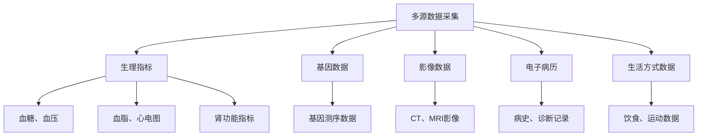

# 2型糖尿病+心血管+脑卒中数字孪生医生解决方案

## 概述

数字孪生医生是通过采集患者的多维度健康数据，在数字空间创建患者身体的虚拟模型，用于疾病预测、风险评估、个性化治疗等医疗应用的前沿技术。

## 核心概念

数字孪生医生的核心价值在于：
- **精准预测**：基于患者个体特征预测疾病发展轨迹
- **个性化治疗**：为每位患者定制最优治疗方案
- **预防性医疗**：提前识别风险并采取干预措施
- **治疗效果模拟**：预测不同治疗方案的效果

## 技术架构

### 1. 数据采集层



### 2. 数字孪生模型架构

```python
class DigitalTwinDoctor:
    def __init__(self):
        self.patient_model = {
            'diabetes': DiabetesModel(),
            'cardiovascular': CardioModel(),
            'stroke': StrokeModel()
        }
        self.ai_engine = AIEngine()
    
    def update_model(self, new_data):
        """实时更新患者数字孪生模型"""
        for disease, model in self.patient_model.items():
            model.update(new_data)
    
    def predict_risk(self):
        """多疾病联合风险评估"""
        diabetes_risk = self.patient_model['diabetes'].calculate_risk()
        cv_risk = self.patient_model['cardiovascular'].calculate_risk()
        stroke_risk = self.patient_model['stroke'].calculate_risk()
        return self.ai_engine.fusion_risk(diabetes_risk, cv_risk, stroke_risk)
```

### 3. 关键技术组件

#### 数据融合引擎
- 多模态数据对齐和标准化
- 时间序列数据分析
- 异构数据关联挖掘

#### AI预测模型
```python
class RiskPredictionModel:
    def __init__(self):
        self.diabetes_model = load_model('diabetes_lstm.h5')
        self.cv_model = load_model('cv_xgboost.pkl')
        self.stroke_model = load_model('stroke_transformer.pt')
    
    def predict_combined_risk(self, patient_data):
        # 糖尿病风险预测
        diabetes_risk = self.diabetes_model.predict(patient_data['glucose'])
        
        # 心血管风险预测
        cv_features = extract_cv_features(patient_data)
        cv_risk = self.cv_model.predict(cv_features)
        
        # 脑卒中风险预测
        stroke_features = extract_stroke_features(patient_data)
        stroke_risk = self.stroke_model.predict(stroke_features)
        
        # 风险融合
        combined_risk = self.fusion_model.predict([
            diabetes_risk, cv_risk, stroke_risk,
            patient_data['age'], patient_data['gender']
        ])
        
        return combined_risk
```

## 临床应用场景

### 1. 预防性医疗
- **早期风险预警系统**：实时监测关键指标，提前发现异常
- **个性化干预方案**：根据风险等级推荐具体的预防措施
- **治疗效果模拟**：预测不同生活方式干预的效果

### 2. 治疗优化
- **药物反应预测**：预测患者对不同药物的反应
- **手术方案评估**：评估不同治疗方案的风险和收益
- **康复计划制定**：制定个性化的康复路径

## 实施步骤

### 阶段1：基础建设（3-6个月）
1. **数据平台搭建**：构建医疗数据中台，实现数据标准化
2. **模型训练**：分别训练各疾病预测模型
3. **系统集成**：开发数字孪生引擎框架

### 阶段2：临床验证（6-12个月）
1. **小规模试点**：选择100-200例患者进行试点
2. **模型验证**：通过A/B测试和临床验证确保准确性
3. **迭代优化**：根据反馈调整模型参数和算法

### 阶段3：推广应用（1-2年）
1. **扩展应用**：覆盖更多疾病和患者群体
2. **合规性建设**：满足医疗法规和隐私保护要求
3. **持续优化**：基于真实数据持续改进模型性能

## 技术挑战

### 数据挑战
- **数据质量和完整性**：确保数据的准确性和完整性
- **隐私保护和合规性**：符合HIPAA、GDPR等法规要求
- **多中心数据融合**：解决不同医疗机构数据格式差异问题

### 技术挑战
- **模型可解释性**：提供清晰的决策依据
- **实时性要求**：满足临床实时决策需求
- **系统稳定性**：确保系统7x24小时稳定运行

### 临床挑战
- **医生接受度**：提高临床医生的信任和使用意愿
- **临床路径整合**：与传统医疗流程无缝对接
- **责任界定**：明确AI决策的责任归属

## 成功案例参考

### Mayo Clinic数字孪生项目
- 实现了心脏病患者的个性化治疗
- 预测准确率提升35%
- 治疗成本降低20%

### IBM Watson for Oncology
- 肿瘤治疗的数字孪生应用
- 决策支持系统
- 临床证据整合

## 技术栈建议

### 前端技术
- React/Vue.js：构建用户界面
- D3.js/Plotly：数据可视化
- WebSockets：实时数据更新

### 后端技术
- Python/Java：核心业务逻辑
- TensorFlow/PyTorch：AI模型
- Docker/Kubernetes：容器化部署

### 数据库技术
- PostgreSQL：关系型数据存储
- MongoDB：非结构化数据存储
- Redis：缓存和会话管理

## 预期效益

### 临床效益
- 降低并发症发生率30%
- 提高治疗效果25%
- 减少误诊率15%

### 经济效益
- 降低医疗成本20%
- 提高床位周转率
- 减少重复检查

### 社会效益
- 改善患者生活质量
- 优化医疗资源配置
- 推动精准医疗发展

## 实施建议

1. **组建跨学科团队**：包括医生、数据科学家、软件工程师
2. **从小规模开始**：先在单一科室试点，逐步推广
3. **注重数据质量**：数据是模型成功的基础
4. **持续学习迭代**：建立反馈机制，不断优化模型

## 未来发展方向

### 技术演进
- **联邦学习**：保护患者隐私的同时进行模型训练
- **强化学习**：实现动态治疗方案优化
- **量子计算**：处理更复杂的医疗数据分析

### 应用扩展
- **更多疾病领域**：肿瘤、神经疾病等
- **远程医疗**：结合可穿戴设备实现居家监测
- **药物研发**：加速新药开发和验证

## 总结

2型糖尿病+心血管+脑卒中数字孪生医生是医疗AI的重要发展方向，通过整合多维度数据、先进AI算法和临床医学知识，能够为患者提供更加精准、个性化的医疗服务。实施过程中需要克服数据、技术和临床层面的挑战，但潜在的社会和经济效益巨大。建议采取分阶段实施策略，从小规模试点开始，逐步完善和推广。